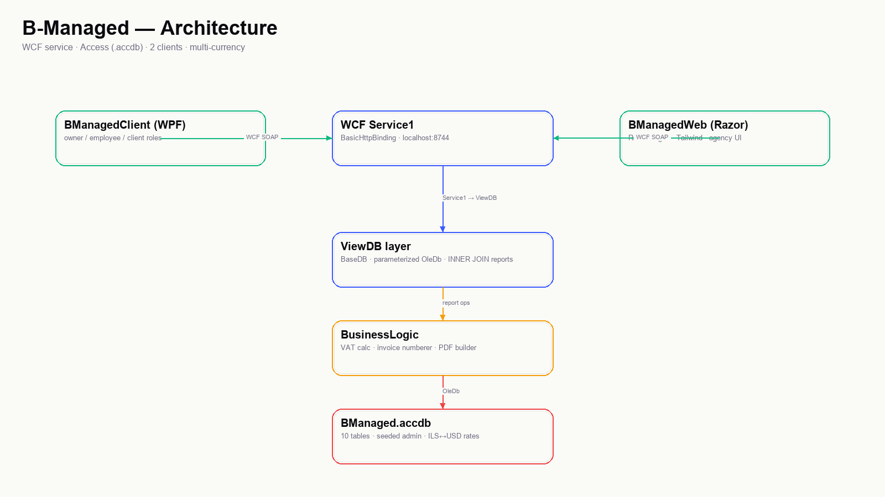
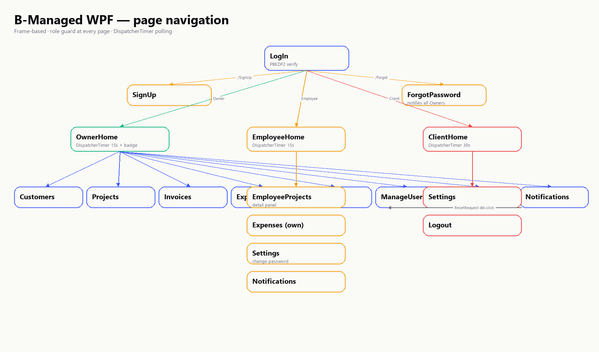
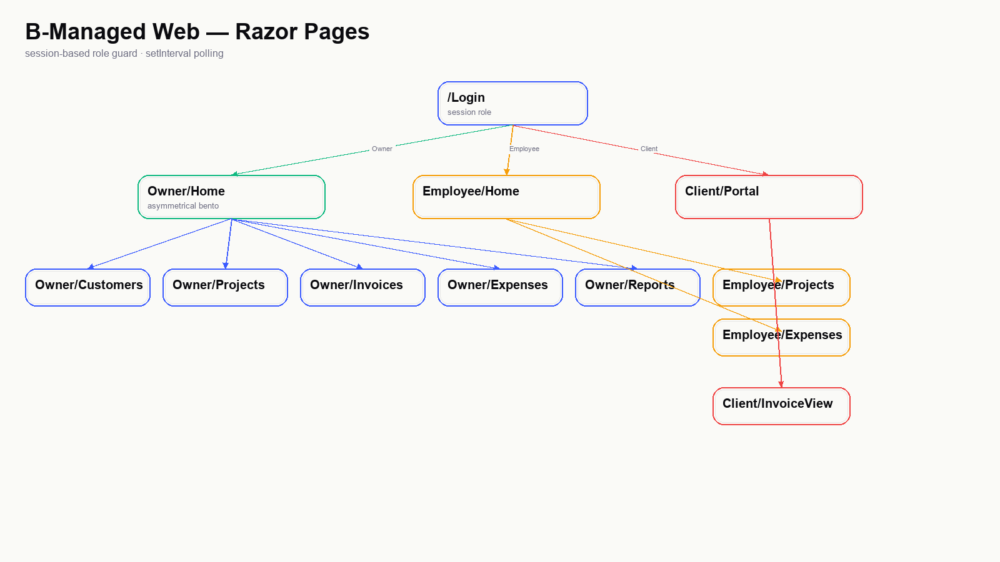

ספר פרויקט בהנדסת תוכנה

# B-Managed — מערכת לניהול עסק קטן: לקוחות, פרויקטים, חשבוניות, הוצאות, מע״מ והתראות

| שדה | ערך |
|------|------|
| מקצוע | שירותי אינטרנט, תכנות אסינכרוני ומסדי נתונים |
| שם בית הספר | מקיף ז אשדוד |
| שם התלמיד | אלי רפופורט |
| שם המנחה | אולגה גנדלמן |
| תאריך הגשה | 06/05/2026 |
| גרסת ספר | FINAL v6 |

מסמך זה הוא הגרסה המורחבת של ספר הפרויקט. כל אלמנט במערכת מתועד עם הפנייה מדויקת לקובץ ושורה, וכולל קטעי קוד אמיתיים מהפרויקט. כדי לצמצם נפח הספר אינו כולל את כל הקוד אלא רק קטעים מייצגים. לקוד המלא ראו את התיקיות בפרויקט.

---

## תוכן עניינים

1. מבוא ורקע
2. מענה על דרישות המחוון
3. ניתוח מערכת
4. ארכיטקטורה כללית + App.config
5. בסיס הנתונים Access
6. שכבת ה-Model + DataContract
7. שכבת השרת WCF (IService1, Service1)
8. שכבת ה-ViewDB וגישה ל-Access
9. SQL מתקדם — INSERT, UPDATE, INNER JOIN, GROUP BY
10. אבטחה ובדיקות קלט (PBKDF2, Validation, IValueConverter, Sanitize, SQL Injection)
11. לקוח WPF (BManagedClient)
12. לקוח Web — ASP.NET Razor Pages
13. תהליכים עסקיים מקצה לקצה
14. התראות ושכבת Notifications + Polling
15. חשבוניות, מע״מ ודו״חות
16. הוצאות + העלאת קבלות + Auto-VAT
17. הקצאת עובדים לפרויקטים (Multi-assign)
18. רב-מטבעיות (ILS + USD) + ExchangeRates
19. תיקוני באגים שבוצעו
20. מפות ניווט (WPF / Web flow PNG) + ירושה + Async
21. מפת הפרויקט (Project Map) — תמונות זרימה
22. סיכום ורפלקציה
23. נספחים — צילומי מסך, רשימת קבצים, ביבליוגרפיה
24. עדכון 2026 — מודל עוסק תקין (Patur / Murshe / Zair) ושינוי מע״מ ל-18%
25. הלוואות עסקיות וקרנות (קרן) — מעקב חוב ויחס חוב להכנסה
26. דשבורד אנליטיקה מתקדם — Receivables Aging, Payment Lag, Concentration, Runway
27. שיפורי חוויית משתמש (UX) — Login Spinner, ולידציות הרשמה, הרשמת עובד/בעלים ב-WPF, חוזה→חשבונית→הושלם

---

# 1. מבוא ורקע

B-Managed היא מערכת מידע לניהול עסק קטן (פרילנסרים וסטודיו של עד עשרה עובדים). הרעיון נולד מהפער בין כלים יקרים כמו QuickBooks (חודשיים) לבין גליונות אקסל ידניים: עסק קטן צריך מקום אחד לראות לקוחות, פרויקטים, חשבוניות, הוצאות, מע״מ לתשלום והתראות — בלי לשלם 200 ₪ בחודש.

המערכת נותנת פתרון מלא לשלוש רמות הרשאה:

| תפקיד | מה הוא רואה | מה הוא יכול לעשות |
|--------|--------------|----------------------|
| Owner (בעלים) | הכל | מנהל לקוחות, פרויקטים, חשבוניות, הוצאות, דו״חות, מאשר/חוסם משתמשים, מחלק סיסמאות |
| Employee (עובד) | פרויקטים שהוקצו אליו, ההוצאות שלו, ההתראות שלו | מדווח על הוצאות, רואה מטלות |
| Client (לקוח) | החשבוניות שלו | רואה יתרת חוב, מוריד PDF |

בנוסף קיים פיצול לשני לקוחות: WPF (שולחני, Windows) ו-Web (דפדפן, ASP.NET Razor Pages). שניהם מדברים מול אותו שרת WCF.

קהל יעד: פרילנסרים, מעצבים, מתכנתים עצמאיים, סטודיו עיצוב/פיתוח, עורכי דין יחידים.

מטרת על: לרכז במקום אחד את ניהול הלקוחות, הפרויקטים, החשבוניות, ההוצאות, המע״מ וההתראות — תוך תמיכה דו-לשונית (עברית + אנגלית) ורב-מטבעית (ש״ח + דולר).

טכנולוגיות: Visual Studio 2022, C# (.NET Framework 4.7.2 לשרת+WPF, .NET 8 ל-Web), WCF (BasicHttpBinding על פורט 8733), WPF, ASP.NET Razor Pages, XAML, Razor + Tailwind CSS via CDN, Plus Jakarta Sans + Clash Display, MS Access (.accdb) דרך OleDb, PdfSharp 1.50.5147, Chart.js 4.4.

אתגרים מרכזיים:

* סנכרון בין שני לקוחות שונים מול אותו שרת.
* ניהול הרשאות לפי תפקיד בכל אחד מהלקוחות.
* אבטחת סיסמאות עם PBKDF2 והגנה מפני SQL Injection ו-XSS.
* חישוב מע״מ נכון לפי הנוסחה הישראלית (ברוטו × 17/117).
* תמיכה ברב-מטבעיות (ILS ↔ USD) עם המרה לפי ExchangeRates.
* אוטומציה של תהליך איפוס סיסמה דרך התראות.
* טיפול במצב off-line (אם השרת נופל) — ה-WPF תופס FaultException ומציג למשתמש הודעה ברורה.

---

# 2. מענה על דרישות המחוון

פרק זה ממופה ישירות מול המסמכים *פירוט דרישות חלק 1* ו-*בדיקת פרויקט וספר פרויקט עפ"י דרישות*. כל סעיף מציין היכן בפרויקט נמצא המענה (קובץ + שורה) ומפנה לפרק המפורט בהמשך הספר.

## 2.1 דרישות חובה (סעיפים 1–8 במחוון)

| # | דרישה במחוון | מענה בפרויקט | מקום בקוד / בספר |
|---|---------------|----------------|---------------------|
| 1 | התוכנית מהווה ממשק מלא למערכת מידע, עם שליפה ממספר טבלאות ועדכון | `Service1` חושף ~50 פעולות שירות שמטפלות ב-13 טבלאות. כל פעולה היא Select/Insert/Update/Delete מובנית | `WcfServiceLibrary1/WcfServiceLibrary1/IService1.cs` (כל הפעולות) — פרק 7 |
| 2 | שימוש בנתונים ממסד נתונים, ובלקוחות פקדים שונים | בסיס Access דרך OleDb בשרת. בלקוחות: TextBox, ComboBox, DatePicker, ListView, GridView, ListBox, RadioButton, Border, ScrollViewer | `BManagedClient/`, `BManagedWeb/` — פרקים 11, 12 |
| 3 | מסד מנורמל עם מספר טבלאות + טבלאות קישור | 13 טבלאות. טבלאות קישור: `InvoiceLines` (Invoice↔לפרטים), `ProjectAssignments` (Project↔Employee, יחס רבים-לרבים), `Notifications` (User↔הודעה), `ExchangeRates` (FromCurrency↔ToCurrency) | פרק 5 |
| 4 | 2/3 לקוחות בעלי ממשק נח: חלונאי / אינטרנטי / טלפוני | שני לקוחות: WPF (חלונאי) + ASP.NET Razor Pages (אינטרנטי) | `BManagedClient/`, `BManagedWeb/` — פרקים 11, 12 |
| 5 | ניהול נתונים חכם — שאילתות מורכבות, חיתוך, עדכון | INNER JOIN בין `Invoices↔Customers↔Projects↔Users(Employees)` + GROUP BY + SUM. UPDATE לפי תנאים | `WcfServiceLibrary1/ViewDB/ReportsDB.cs`, `ProjectDB.cs:50-60` — פרק 9 |
| 6 | תכנות מונחה עצמים + ירושה | כל מודלי הנתונים יורשים מ-`Base`. ה-DBים יורשים מ-`BaseDB`. דוגמאות נוספות: `AllUsers : List<User>` | `Model/Base.cs`, `ViewDB/BaseDB.cs` — פרק 6 + פרק 20 |
| 7 | מספר רמות הרשאה — מנהל, לקוח, עובד | שלוש רמות: `Owner`, `Employee`, `Client`. כל לקוח משדר את `Role` שלו | `LogIn.xaml.cs`, `Login.cshtml.cs`, `ClientSession.cs` — פרקים 7 + 11 + 12 |
| 8 | UI מציג רק אפשרויות בהתאם לרמת ההרשאה | `_Layout.cshtml` מסתיר טאבים לפי `Session["Role"]`. `OwnerHome.xaml.cs` בודק `ClientSession.IsOwner` בכניסה. דפי Web בודקים `Session["Role"]` ב-`OnGet` | `BManagedWeb/Pages/Shared/_Layout.cshtml:77-96`, `BManagedClient/OwnerHome.xaml.cs:23-28` |

## 2.2 הרחבות שנבחרו (סעיף 9 ו-10)

לפי ההנחיות, נבחרה אפשרות (1): שני נושאים מסעיף 9 + נושאים נוספים מסעיף 10 כתמיכה.

### 2.2.1 הרחבות מסעיף 9

| נושא | הסבר | מקום בקוד |
|--------|--------|-------------|
| A. העברת קבצים בין שרת ללקוח (PDF + תמונות) | `GenerateInvoicePdf(int invoiceId) → byte[]`. השרת מייצר PDF דרך PdfSharp ומחזיר מערך בייטים. הלקוח שומר לקובץ. בנוסף — `UploadReceipt(int expenseId, byte[] fileBytes, string fileName) → string` להעלאת קבלות מהלקוח לשרת | `Service1.cs:UploadReceipt`, `BusinessLogic/InvoicePdfBuilder.cs` — פרק 16 |
| B. הצפנה מסוג חד-סטרי PBKDF2 | סיסמאות נשמרות כ-hash אחרי `Rfc2898DeriveBytes` עם 16-byte salt + 10000 iterations + `SlowEquals` (constant-time) | `WcfServiceLibrary1/Model/Helpers/SecurityHelper.cs:21-106` — פרק 10.1 |
| C. מספר משתמשים באותו פרויקט (Multi-tenant) | טבלת `ProjectAssignments` (יחס רבים-לרבים) מאפשרת להקצות מספר עובדים לאותו פרויקט. `EnsureSchema()` יוצרת את הטבלה אוטומטית בריצה ראשונה | `ViewDB/ProjectAssignmentDB.cs` — פרק 17 |

### 2.2.2 הרחבות מסעיף 10

| נושא | הסבר | מקום בקוד |
|--------|--------|-------------|
| Polling/Async (DispatcherTimer + setInterval) | `OwnerHome.xaml.cs` מרענן סטטיסטיקות + תג התראות כל 15 שניות. `EmployeeHome` כל 15. `ClientHome` כל 30. ב-Web — `setInterval` כל 30 שניות לתג ההתראות, וכל 15 ל-OwnerHome stats | `BManagedClient/OwnerHome.xaml.cs:30-55`, `BManagedWeb/Pages/Shared/_Layout.cshtml:135-152` — פרק 14 |
| ValueConverter (IValueConverter) | `ImgConventer` ממיר ערך טקסטואלי `Paid/Unpaid` לתמונת אייקון. נשמר עבור עתיד תצוגה גרפית של סטטוס חשבונית | `BManagedClient/ImgConventer.cs` — פרק 10.4 |
| INNER JOIN + GROUP BY + SUM | 4 דו״חות שונים: TopCustomersByRevenue, ExpenseBreakdown, EmployeeRevenueReport, ProfitLoss | `ViewDB/ReportsDB.cs` — פרק 9 + פרק 15 |
| Validation Rules ב-WPF | 7 כללים: AgeRange, EmailRule, PhoneRule, MinLenth, LessonPriceRule, isAdminRule, TeacherIdRule | `BManagedClient/ValidationRules.cs` — פרק 10.3 |
| רב-מטבעיות ILS + USD | טבלת `ExchangeRates` + מחלקת `CurrencyConverter`. כל הדו״חות מקבלים `displayCurrency` וכל שורת הכנסה/הוצאה מומרת לפני אגרגציה | `BusinessLogic/CurrencyConverter.cs`, `ViewDB/ExchangeRateDB.cs` — פרק 18 |
| התראות (Notifications) עם Mark-as-read + Live polling | טבלת `Notifications` + `NotificationDB` + UI תג חי על השעון בכל לקוח | `ViewDB/NotificationDB.cs`, `BManagedClient/Notifications.xaml.cs` — פרק 14 |
| בינלאומיות (i18n) | מתג שפה EN/HE לפי `Session["Lang"]`. מחלקת עוזרת `L.T(HttpContext, "en", "he")` ותמיכת RTL בכל דף | `BManagedWeb/Helpers/L.cs`, `BManagedWeb/Pages/Lang.cshtml` — פרק 12 |

## 2.3 מענה לדרישות *פירוט דרישות חלק 1*

| דרישה | מענה |
|---------|--------|
| Visual Studio + C# | כן — VS 2022 + C# |
| מספר ServiceContract / OperationContract | `IService1` חושף ~50 OperationContract |
| DataContract / DataMember | כל המודלים: `Customer`, `Project`, `Invoice`, `InvoiceLine`, `Expense`, `ExpenseCategory`, `Notification`, `User`, `VatSummary`, `ProfitLoss` — כולם `[DataContract]` |
| KnownType לתת-מחלקות | `Base` מכריזה על `KnownType(Customer)`, `KnownType(Project)`, וכו׳ |
| ולידציה צד-לקוח + צד-שרת | WPF: `ValidationRules.cs`. שרת: `SecurityHelper.IsSafeString` + בדיקות length+null + `FaultException` |
| Async UI Thread | `DispatcherTimer` ב-WPF + `setInterval` בדפדפן |
| מסך נפרד לכל תפקיד | OwnerHome, EmployeeHome, ClientHome ב-WPF; Owner/, Employee/, Client/ ב-Web |
| גישה ל-DB דרך OleDb | `BaseDB.GetConnection()` משתמש ב-`Microsoft.ACE.OLEDB.12.0` |
| App.config + endpoint config | פורט 8733, BasicHttpBinding עם `maxReceivedMessageSize=20MB` |

## 2.4 מבנה הספר

הספר בנוי בצורה היררכית: כל פרק מתחיל בהקשר עסקי, ממשיך לקטעי קוד מייצגים מהפרויקט (עם הפנייה לקובץ ושורה), ומסיים בנקודות לתשומת לב.

---

# 3. ניתוח מערכת

## 3.1 מסמך ייזום

* בעיה עסקית: עסק קטן (1–10 איש) צריך לנהל לקוחות, פרויקטים, חשבוניות והוצאות במקום אחד — בלי לשלם מחיר חודשי לכלי ענן.
* פתרון: מערכת ביתית עם שרת WCF + שני לקוחות (חלונאי לעבודה היומיומית של הבעלים, אינטרנטי לעובדים ולקוחות).
* ערך מוסף מעבר לאקסל: דו״חות מע״מ אוטומטיים, התראות חיות, רב-מטבעיות, ייצוא PDF, היסטוריה מלאה לכל לקוח.

## 3.2 מצב קיים מול מצב עתידי

| תהליך | מצב קיים (אקסל / מייל) | מצב עתידי (B-Managed) |
|---------|----------------------------|---------------------------|
| ניהול לקוחות | רשימה באקסל + פרטים בכרטיסי איש קשר | טבלת Customers + מסך CRM עם חיפוש |
| הפקת חשבונית | Word עם טבלה ידנית + שמירה כ-PDF | טופס מוכן, מספור אוטומטי, חישוב מע״מ אוטומטי, הפקה ל-PDF דרך PdfSharp |
| מעקב הוצאות | קבלות בקופסה + סיכום סוף-חודש | טופס מהיר עם Auto-VAT 17/117 + העלאת קבלה |
| חישוב מע״מ לתשלום | חישוב ידני בסוף חודש | `GetVatSummary(year, month)` + כפתור "סמן ששולם לרשות המסים" |
| הקצאת עובדים | בעל-פה / WhatsApp | טבלת `ProjectAssignments` רבים-לרבים + UI עם רשימת עובדים מוקצים |
| התראות | מיילים + WhatsApp | מערכת התראות עם תג חי על השעון |
| איפוס סיסמה | טלפוני | תהליך אוטומטי: `ForgotPassword` → התראה לכל הבעלים → לחיצה כפולה פותחת ManageUsers |

## 3.3 Use Cases מרכזיים

* UC1: בעל עסק רושם הוצאת דלק של 234 ₪ — ממלא טופס, לוחץ Auto-VAT 17 % → המערכת ממלאת 34 ₪ מע״מ. שמירה.
* UC2: בעל עסק רוצה לראות כמה מע״מ הוא חייב לשלם החודש — נכנס ל-Reports, רואה "VAT due = 1,420 ₪". לוחץ "Mark as paid to Tax Authority".
* UC3: בעל עסק מקצה לפרויקט שלושה עובדים — נכנס ל-Projects, בוחר פרויקט, מוסיף שלושה עובדים מהרשימה.
* UC4: עובד מתחבר וצריך לראות רק את הפרויקטים שלו — לוחץ "My projects" ב-EmployeeHome.
* UC5: לקוח מתחבר ורוצה לראות יתרת חוב — נכנס ל-Client Portal, רואה את כל החשבוניות + סכום פתוח.
* UC6: עובד שכח סיסמה — לוחץ Forgot password, הבעלים מקבל התראה, לוחץ עליה כפול → ManageUsers, לוחץ Reset PW. בכניסה הבאה של העובד עם reset1234 — הוא מנותב אוטומטית ל-Settings.

## 3.4 DFD-0 מילולי

המשתמש מקליד שם משתמש וסיסמה ב-LogIn → הלקוח (WPF/Web) שולח SOAP ל-Service1 → Service1 מבצע `userDB.VerifyPassword` → `SecurityHelper.VerifyPassword(plain, hash)` משווה PBKDF2 → אם תקין: נכנס ל-OwnerHome / EmployeeHome / ClientHome (לפי `user.Role`).

## 3.5 עץ תהליכים

```
LogIn → (Owner) → OwnerHome → Customers ↔ Projects ↔ Invoices ↔ Expenses ↔ Reports ↔ Users
                            ↓
                          Notifications (live polling)
                            ↓
                          Settings (change profile / password)
```

---

# 4. ארכיטקטורה כללית

ארכיטקטורה לפי שכבות (Layered):

```
+-------------------------------------------+
|  Clients                                  |
|   - WPF  (BManagedClient/)  — desktop     |
|   - Web  (BManagedWeb/)     — Razor Pages |
+-------------------------------------------+
                ↓ SOAP / BasicHttpBinding (port 8733)
+-------------------------------------------+
|  WCF Service (Service1 : IService1)       |
|   ~50 OperationContract                   |
+-------------------------------------------+
                ↓
+-------------------------------------------+
|  BusinessLogic                            |
|   - InvoicePdfBuilder (PdfSharp)          |
|   - VatCalculator                         |
|   - InvoiceNumberer                       |
|   - CurrencyConverter                     |
+-------------------------------------------+
                ↓
+-------------------------------------------+
|  ViewDB  (one DB class per table)         |
|   - BaseDB (abstract)                     |
|   - UserDB / CustomerDB / ProjectDB / ... |
+-------------------------------------------+
                ↓ OleDb
+-------------------------------------------+
|  MS Access — BManaged.accdb (13 tables)   |
+-------------------------------------------+
```

קובץ `App.config` של השרת מגדיר:

```xml
<system.serviceModel>
  <bindings>
    <basicHttpBinding>
      <binding name="BasicHttpBinding_IService1"
               maxReceivedMessageSize="20000000"
               maxBufferSize="20000000" />
    </basicHttpBinding>
  </bindings>
  <services>
    <service name="WcfServiceLibrary1.Service1">
      <host>
        <baseAddresses>
          <add baseAddress="http://localhost:8733/Design_Time_Addresses/WcfServiceLibrary1/Service1/" />
        </baseAddresses>
      </host>
      <endpoint address="" binding="basicHttpBinding"
                bindingConfiguration="BasicHttpBinding_IService1"
                contract="WcfServiceLibrary1.IService1" />
      <endpoint address="mex" binding="mexHttpBinding" contract="IMetadataExchange"/>
    </service>
  </services>
</system.serviceModel>
```

הפורט 8733 נבחר כי הוא רשום מראש ב-VS Installer ב-Windows Defender → לא צריך admin להרצת WcfSvcHost.

---

# 5. בסיס הנתונים Access

## 5.1 טבלאות מרכזיות

```
Users (id COUNTER PRIMARY, username, passwordHash, email, phone, role, isActive, createdAt, preferredCurrency)

Customers (id COUNTER PRIMARY, businessName, contactName, email, phone, taxId, address,
           ownerId LONG → Users.id, notes, preferredCurrency)

Projects (id COUNTER PRIMARY, customerId LONG → Customers.id, title, description,
          status, startDate, dueDate, assignedEmployeeId LONG NULL → Users.id,
          totalBudget CURRENCY, currency)

Invoices (id COUNTER PRIMARY, invoiceNumber TEXT(20) UNIQUE, projectId LONG → Projects.id,
          customerId LONG → Customers.id, issueDate, dueDate, subtotal CURRENCY,
          vatRate DOUBLE, vatAmount CURRENCY, total CURRENCY, status, paidDate, currency)

InvoiceLines (id COUNTER PRIMARY, invoiceId LONG → Invoices.id, description,
              quantity DOUBLE, unitPrice CURRENCY, lineTotal CURRENCY, currency)

Expenses (id COUNTER PRIMARY, ownerId LONG → Users.id, categoryId LONG → ExpenseCategories.id,
          date, amount CURRENCY, vatPaid CURRENCY, vendor, description,
          projectId LONG NULL, receiptPath, currency)

ExpenseCategories (id COUNTER PRIMARY, name, isVatDeductible BIT)

TaxPeriods (id COUNTER PRIMARY, year, month, vatCollected CURRENCY,
            vatPaid CURRENCY, vatDue CURRENCY, incomeTotal, expensesTotal,
            profitEstimate, taxSetAside)

Notifications (id COUNTER PRIMARY, userId LONG → Users.id, title, message,
               notificationType, isRead BIT, createdAt, readAt)

ExchangeRates (id COUNTER PRIMARY, fromCurrency, toCurrency, rate DOUBLE, effectiveDate)

ProjectAssignments (id COUNTER PRIMARY, projectId LONG → Projects.id,
                    employeeId LONG → Users.id, assignedAt)
```

## 5.2 הקשרים (Foreign Keys לוגיים)

ה-Access אינו אוכף FK באופן קשיח — הקשרים נשמרים ברמת הקוד דרך JOIN ושאילתות שרת. הסיבה לבחירה זו: ביצועים טובים יותר ל-Access ופחות מורכבות בהגדרות הסכמה.

## 5.3 יצירה דינמית של טבלת ProjectAssignments

עבור הטבלה `ProjectAssignments` בחרתי גישה של auto-schema — הטבלה נוצרת אוטומטית בריצה ראשונה של השרת. כך לא צריך migration ידני ל-`.accdb` של מי שכבר השתמש בגרסה ישנה:

```csharp
// WcfServiceLibrary1/ViewDB/ProjectAssignmentDB.cs:21-46
public ProjectAssignmentDB() => EnsureSchema();

private void EnsureSchema()
{
    using (var conn = GetConnection())
    using (var cmd = new OleDbCommand(
        "CREATE TABLE [ProjectAssignments] (" +
        "  [id] COUNTER PRIMARY KEY," +
        "  [projectId] LONG," +
        "  [employeeId] LONG," +
        "  [assignedAt] DATETIME)", conn))
    {
        try { conn.Open(); cmd.ExecuteNonQuery(); }
        catch (OleDbException ex)
        {
            // Access throws "already exists" אם הטבלה כבר קיימת — מתעלמים בשקט
            if (!(ex.Message.IndexOf("already exists",
                  StringComparison.OrdinalIgnoreCase) >= 0))
                System.Diagnostics.Debug.WriteLine(ex.Message);
        }
    }
}
```

---

# 6. שכבת ה-Model + DataContract

כל מודל יורש מ-`Base` ומסומן `[DataContract]` כדי לעבור serialization ב-WCF:

```csharp
// Model/Base.cs
[DataContract]
[KnownType(typeof(Customer))]
[KnownType(typeof(Project))]
[KnownType(typeof(Invoice))]
[KnownType(typeof(InvoiceLine))]
[KnownType(typeof(Expense))]
[KnownType(typeof(ExpenseCategory))]
[KnownType(typeof(Notification))]
[KnownType(typeof(User))]
public class Base
{
    [DataMember] public int Id { get; set; }
}

// Model/Customer.cs
[DataContract]
public class Customer : Base
{
    [DataMember] public string BusinessName { get; set; }
    [DataMember] public string ContactName  { get; set; }
    [DataMember] public string Email        { get; set; }
    [DataMember] public string Phone        { get; set; }
    [DataMember] public string TaxId        { get; set; }
    [DataMember] public string Address      { get; set; }
    [DataMember] public int    OwnerId      { get; set; }
    [DataMember] public string Notes        { get; set; }
    [DataMember] public string PreferredCurrency { get; set; } = "ILS";
}
```

מחלקות הדו״חות (`VatSummary`, `ProfitLoss`, `CustomerRevenueRow`, `ExpenseBreakdownRow`, `EmployeeRevenueRow`) חיות ב-`Model/Reports.cs` ואינן יורשות מ-`Base` כי אין להן Id.

---

# 7. שכבת השרת WCF

## 7.1 ServiceContract (Interface)

`IService1` חושף ~50 פעולות שירות, מקובצות לפי נושא:

```csharp
[ServiceContract]
public interface IService1
{
    // ==================== AUTH & USERS ====================
    [OperationContract] bool CheckUserPassword(string username, string password);
    [OperationContract] bool CheckUserExist(string username);
    [OperationContract] User GetUserById(int id);
    [OperationContract] int GetUserId(string username);
    [OperationContract] bool AddUser(string username, string password, string email,
                                     string phone, string role, string preferredCurrency);
    [OperationContract] void ResetPassword(int userId, string newPassword);
    [OperationContract] void UpdateUserRole(int userId, string newRole);
    [OperationContract] List<User> GetPendingUsers();
    [OperationContract] void SetUserActive(int userId, bool isActive);
    [OperationContract] void DeleteUser(int userId);
    [OperationContract] AllUsers GetAllUsers();

    // ==================== CUSTOMERS ====================
    [OperationContract] int  AddCustomer(Customer c);
    [OperationContract] void UpdateCustomer(Customer c);
    [OperationContract] void DeleteCustomer(int id);
    [OperationContract] Customer GetCustomerById(int id);
    [OperationContract] List<Customer> GetCustomersForOwner(int ownerId);
    [OperationContract] List<Customer> SearchCustomers(string keyword, int ownerId);

    // ==================== PROJECTS ====================
    [OperationContract] int  AddProject(Project p);
    [OperationContract] void UpdateProject(Project p);
    [OperationContract] void SetProjectStatus(int projectId, string status);
    [OperationContract] void AssignEmployee(int projectId, int employeeId);
    [OperationContract] List<Project> GetProjectsByCustomer(int customerId);
    [OperationContract] List<Project> GetProjectsForEmployee(int employeeId);
    [OperationContract] List<Project> GetProjectsByStatus(string status, int ownerId);
    [OperationContract] Project GetProjectById(int id);

    // Many-to-many — multiple employees per project
    [OperationContract] void AddProjectAssignment(int projectId, int employeeId);
    [OperationContract] void RemoveProjectAssignment(int projectId, int employeeId);
    [OperationContract] List<User> GetProjectAssignees(int projectId);

    // ==================== INVOICES ====================
    [OperationContract] int  CreateInvoice(Invoice inv);
    [OperationContract] int  AddInvoiceLine(InvoiceLine line);
    [OperationContract] void UpdateInvoiceStatus(int invoiceId, string status);
    [OperationContract] void MarkInvoicePaid(int invoiceId, DateTime paidDate);
    [OperationContract] byte[] GenerateInvoicePdf(int invoiceId);

    // ==================== EXPENSES ====================
    [OperationContract] int  AddExpense(Expense e);
    [OperationContract] string UploadReceipt(int expenseId, byte[] fileBytes, string fileName);

    // ==================== REPORTS / VAT ====================
    [OperationContract] VatSummary GetVatSummary(int ownerId, int year, int month, string displayCurrency);
    [OperationContract] ProfitLoss GetProfitLoss(int ownerId, DateTime from, DateTime to, string displayCurrency);
    // ... ועוד
}
```

## 7.2 מימוש Service1 — דוגמה

```csharp
// Service1.cs:32-42
public bool CheckUserPassword(string u, string p) => userDB.VerifyPassword(u, p);
public bool CheckUserExist(string u)              => userDB.UserExists(u);
public User GetUserById(int id)                    => userDB.GetById(id);

// Service1.cs:115-146 — GetProjectsForEmployee unions legacy + new multi-assign
public List<Project> GetProjectsForEmployee(int empId)
{
    var result = new Dictionary<int, Project>();
    foreach (var p in projDB.GetByEmployee(empId))
        if (p != null) result[p.Id] = p;
    foreach (var pid in assignDB.GetProjectsByEmployee(empId))
    {
        if (result.ContainsKey(pid)) continue;
        var pr = projDB.GetById(pid);
        if (pr != null) result[pid] = pr;
    }
    return result.Values.ToList();
}
```

---

# 8. שכבת ה-ViewDB וגישה ל-Access

## 8.1 BaseDB — שיטות גנריות

```csharp
// ViewDB/BaseDB.cs
public abstract class BaseDB
{
    private static string connectionString = null;
    protected OleDbConnection connection;
    protected OleDbCommand command;
    protected OleDbDataReader reader;

    protected abstract Base NewEntity();

    public static OleDbConnection GetConnection()
    {
        if (connectionString == null)
        {
            string baseDir = AppDomain.CurrentDomain.BaseDirectory;
            connectionString = "Provider=Microsoft.ACE.OLEDB.12.0;" +
                "Data Source=" + baseDir + "\\..\\..\\..\\ViewDB\\Database\\BManaged.accdb;" +
                "Persist Security Info=True";
        }
        return new OleDbConnection(connectionString);
    }

    /// <summary>SECURE: Execute SELECT with parameterized query</summary>
    protected virtual List<Base> Select(string sql, params OleDbParameter[] parameters)
    {
        // ... פותח חיבור, מבצע, יוצר Entity לכל שורה דרך CreateModel()
    }
}
```

## 8.2 CreateModel — מיפוי DataReader → Object

```csharp
// ViewDB/CustomerDB.cs:18-31
protected override Base NewEntity() => new Customer();

protected override void CreateModel(Base entity)
{
    base.CreateModel(entity);
    if (!(entity is Customer c)) return;
    try { c.BusinessName = reader["businessName"].ToString(); } catch { }
    try { c.ContactName  = reader["contactName"].ToString(); }  catch { }
    try { c.Email        = reader["email"].ToString(); }        catch { }
    try { c.Phone        = reader["phone"].ToString(); }        catch { }
    try { c.TaxId        = reader["taxId"].ToString(); }        catch { }
    try { c.Address      = reader["address"].ToString(); }      catch { }
    try { c.OwnerId      = Convert.ToInt32(reader["ownerId"]); } catch { }
    try { c.Notes        = reader["notes"].ToString(); }        catch { }
    try { c.PreferredCurrency = reader["preferredCurrency"].ToString(); }
    catch { c.PreferredCurrency = "ILS"; }
}
```

ה-`try/catch` סביב כל שדה הוא מדיניות מכוונת: אם `Access` מחזיר `DBNull` עבור עמודה nullable, השדה פשוט נשאר בערכו ההתחלתי במקום לזרוק. זה גם מאפשר תאימות-לאחור — אם נוסיפה עמודה חדשה ל-DB אחרי שהקוד פוקדה, הקוד הישן עדיין עובד.

---

# 9. SQL מתקדם — INSERT, UPDATE, INNER JOIN, GROUP BY

## 9.1 INSERT פרמטרי ל-Customers

```csharp
// ViewDB/CustomerDB.cs:50-66
public int Insert(Customer c)
{
    string sql = @"INSERT INTO [Customers]
        ([businessName],[contactName],[email],[phone],[taxId],[address],
         [ownerId],[notes],[preferredCurrency])
        VALUES (?,?,?,?,?,?,?,?,?)";
    using (var conn = GetConnection())
    using (var cmd = new OleDbCommand(sql, conn))
    {
        cmd.Parameters.Add(new OleDbParameter("@bn", OleDbType.VarWChar, 120) { Value = c.BusinessName ?? "" });
        cmd.Parameters.Add(new OleDbParameter("@cn", OleDbType.VarWChar, 120) { Value = (object)c.ContactName ?? DBNull.Value });
        cmd.Parameters.Add(new OleDbParameter("@e",  OleDbType.VarWChar, 120) { Value = (object)c.Email ?? DBNull.Value });
        cmd.Parameters.Add(new OleDbParameter("@p",  OleDbType.VarWChar, 30)  { Value = (object)c.Phone ?? DBNull.Value });
        cmd.Parameters.Add(new OleDbParameter("@t",  OleDbType.VarWChar, 30)  { Value = (object)c.TaxId ?? DBNull.Value });
        cmd.Parameters.Add(new OleDbParameter("@a",  OleDbType.LongVarWChar)  { Value = (object)c.Address ?? DBNull.Value });
        cmd.Parameters.Add(new OleDbParameter("@o",  OleDbType.Integer)       { Value = c.OwnerId });
        cmd.Parameters.Add(new OleDbParameter("@n",  OleDbType.LongVarWChar)  { Value = (object)c.Notes ?? DBNull.Value });
        cmd.Parameters.Add(new OleDbParameter("@cur",OleDbType.VarWChar, 3)   { Value = c.PreferredCurrency ?? "ILS" });
        conn.Open();
        return cmd.ExecuteNonQuery();
    }
}
```

## 9.2 UPDATE — עדכון פרופיל

```csharp
// ViewDB/UserDB.cs:UpdateProfile
public void UpdateProfile(int id, string email, string phone, string preferredCurrency)
{
    using (var conn = GetConnection())
    using (var cmd = new OleDbCommand(
        "UPDATE [Users] SET [email]=?, [phone]=?, [preferredCurrency]=? WHERE [id]=?", conn))
    {
        cmd.Parameters.Add(new OleDbParameter("@e",  OleDbType.VarWChar) { Value = email ?? "" });
        cmd.Parameters.Add(new OleDbParameter("@p",  OleDbType.VarWChar) { Value = phone ?? "" });
        cmd.Parameters.Add(new OleDbParameter("@c",  OleDbType.VarWChar, 3) { Value = preferredCurrency ?? "ILS" });
        cmd.Parameters.Add(new OleDbParameter("@id", OleDbType.Integer)  { Value = id });
        conn.Open();
        cmd.ExecuteNonQuery();
    }
}
```

## 9.3 INNER JOIN — פרויקטים פעילים של בעלים

```csharp
// ViewDB/ProjectDB.cs:50-60 — סיכום: מסנן פרויקטים לפי סטטוס + שייכות לבעלים
public List<Project> GetByStatus(string status, int ownerId)
{
    string sql = @"SELECT P.*
                   FROM [Projects] AS P
                   INNER JOIN [Customers] AS C ON P.[customerId] = C.[id]
                   WHERE P.[status] = ? AND C.[ownerId] = ?
                   ORDER BY P.[dueDate]";
    return Select(sql,
        new OleDbParameter("@s", status),
        new OleDbParameter("@o", ownerId)).OfType<Project>().ToList();
}
```

ה-INNER JOIN חיוני כי `Project` שייך ל-`Customer`, ו-`Customer` שייך ל-`User` (ה-Owner). אי אפשר לסנן פרויקטים לפי בעלים בלי לעבור דרך `Customers`.

## 9.4 INNER JOIN + GROUP BY + SUM — TopCustomersByRevenue

```csharp
// ViewDB/ReportsDB.cs — GetTopCustomersByRevenue
string sql = @"
    SELECT C.[id], C.[businessName],
           SUM(I.[total])      AS TotalInvoiced,
           SUM(IIF(I.[status]='Paid', I.[total], 0)) AS TotalPaid
    FROM (
        [Customers] AS C
        INNER JOIN [Projects] AS P ON P.[customerId] = C.[id]
    )
    INNER JOIN [Invoices] AS I ON I.[projectId] = P.[id]
    WHERE C.[ownerId] = ?
    GROUP BY C.[id], C.[businessName]
    ORDER BY SUM(I.[total]) DESC";
```

שילוב של 3 טבלאות + GROUP BY + 2 פונקציות אגרגציה (SUM, SUM-conditional). תוצאה: רשימת לקוחות מסודרת לפי סך הכנסות יורד.

## 9.5 INNER JOIN + GROUP BY — ExpenseBreakdown

```csharp
// ViewDB/ReportsDB.cs — GetExpenseBreakdown
string sql = @"
    SELECT EC.[name], EC.[isVatDeductible],
           SUM(E.[amount]) AS Total
    FROM [Expenses] AS E
    INNER JOIN [ExpenseCategories] AS EC ON E.[categoryId] = EC.[id]
    WHERE E.[ownerId] = ? AND E.[date] BETWEEN ? AND ?
    GROUP BY EC.[name], EC.[isVatDeductible]
    ORDER BY SUM(E.[amount]) DESC";
```

JOIN עם `ExpenseCategories` כדי לקבל את שם הקטגוריה (לא רק ה-id), GROUP BY כדי לסכם הוצאות לכל קטגוריה.

## 9.6 שאילתת ProjectAssignments — אגרגציית עובדים מוקצים

```csharp
// ViewDB/ProjectAssignmentDB.cs:88-99
public List<int> GetAssigneesByProject(int projectId)
{
    var ids = new List<int>();
    using (var conn = GetConnection())
    using (var cmd = new OleDbCommand(
        "SELECT [employeeId] FROM [ProjectAssignments] WHERE [projectId]=?", conn))
    {
        cmd.Parameters.Add(new OleDbParameter("@p", OleDbType.Integer) { Value = projectId });
        conn.Open();
        using (var rdr = cmd.ExecuteReader())
            while (rdr.Read()) ids.Add(Convert.ToInt32(rdr[0]));
    }
    return ids;
}
```

---

# 10. אבטחה ובדיקות קלט

## 10.1 SecurityHelper — PBKDF2 hashing

```csharp
// WcfServiceLibrary1/Model/Helpers/SecurityHelper.cs
public static class SecurityHelper
{
    private const int SaltSize = 16;
    private const int Iterations = 10000;

    public static string HashPassword(string password)
    {
        byte[] salt = new byte[SaltSize];
        using (var rng = RandomNumberGenerator.Create()) rng.GetBytes(salt);
        using (var pbkdf2 = new Rfc2898DeriveBytes(password, salt, Iterations))
        {
            byte[] hash = pbkdf2.GetBytes(20);
            byte[] combined = new byte[36];
            Array.Copy(salt, 0, combined, 0, 16);
            Array.Copy(hash, 0, combined, 16, 20);
            return Convert.ToBase64String(combined);
        }
    }

    public static bool VerifyPassword(string password, string storedHash)
    {
        byte[] combined = Convert.FromBase64String(storedHash);
        byte[] salt = new byte[16];
        byte[] hash = new byte[20];
        Array.Copy(combined, 0, salt, 0, 16);
        Array.Copy(combined, 16, hash, 0, 20);
        using (var pbkdf2 = new Rfc2898DeriveBytes(password, salt, Iterations))
            return SlowEquals(pbkdf2.GetBytes(20), hash);
    }

    /// <summary>Constant-time comparison to defeat timing attacks.</summary>
    private static bool SlowEquals(byte[] a, byte[] b)
    {
        uint diff = (uint)a.Length ^ (uint)b.Length;
        for (int i = 0; i < a.Length && i < b.Length; i++)
            diff |= (uint)(a[i] ^ b[i]);
        return diff == 0;
    }
}
```

* PBKDF2 = Password-Based Key Derivation Function 2 (RFC 2898).
* 10,000 איטרציות עושות את הברוט-פורס יקר (≈100ms לסיסמה אחת).
* `SlowEquals` משווה bytes ב-time קבוע כדי למנוע timing-attack.

## 10.2 IsSafeString — סניטציית שמות משתמש

```csharp
// SecurityHelper.cs
public static bool IsSafeString(string s, int maxLen)
{
    if (string.IsNullOrEmpty(s) || s.Length > maxLen) return false;
    foreach (char c in s)
        if (!char.IsLetterOrDigit(c) && c != '_' && c != '.' && c != '-' && c != '@')
            return false;
    return true;
}
```

חוסם תווים מסוכנים כמו `'`, `;`, `--`, `<`, `>` בשם משתמש או באימייל.

## 10.3 ValidationRules ב-WPF

```csharp
// BManagedClient/ValidationRules.cs
public class EmailRule : ValidationRule
{
    public override ValidationResult Validate(object value, CultureInfo culture)
    {
        string email = (string)value;
        Regex regex = new Regex(@"^([\w\.\-]+)@([\w\-]+)((\.(\w){2,3})+)$");
        return regex.IsMatch(email)
            ? ValidationResult.ValidResult
            : new ValidationResult(false, "Please enter a legal Email.");
    }
}

public class PhoneRule : ValidationRule
{
    public override ValidationResult Validate(object value, CultureInfo culture)
    {
        string phone = (string)value;
        return Regex.IsMatch(phone, "^[1-9][0-9]{8}$")
            ? ValidationResult.ValidResult
            : new ValidationResult(false, "Please enter a legal phone.");
    }
}

public class MinLenth : ValidationRule
{
    public override ValidationResult Validate(object value, CultureInfo culture)
    {
        string str = (string)value;
        return str.Length >= 4
            ? ValidationResult.ValidResult
            : new ValidationResult(false, "Password and Username must be at least 4 characters long");
    }
}
```

הם מורכבים על TextBox דרך XAML:

```xml
<TextBox.Text>
    <Binding Path="Username" UpdateSourceTrigger="PropertyChanged">
        <Binding.ValidationRules>
            <local:MinLenth/>
        </Binding.ValidationRules>
    </Binding>
</TextBox.Text>
```

## 10.4 IValueConverter — `ImgConventer`

```csharp
// BManagedClient/ImgConventer.cs
public class ImgConventer : IValueConverter
{
    public object Convert(object value, Type t, object p, CultureInfo c)
    {
        string status = value?.ToString();
        return status == "Paid"
            ? new BitmapImage(new Uri("Images/check.png", UriKind.Relative))
            : new BitmapImage(new Uri("Images/cross.png", UriKind.Relative));
    }
    public object ConvertBack(object v, Type t, object p, CultureInfo c)
        => throw new NotImplementedException();
}
```

## 10.5 ולידציות צד-שרת בWeb Razor

ב-`Web` הולידציה צד-שרת מתבצעת ב-`OnPost`:

```csharp
// BManagedWeb/Pages/Owner/Customers.cshtml.cs:43-45
if (string.IsNullOrWhiteSpace(NewBusinessName))
{ Message = "Business name required"; IsSuccess = false; return OnGet(); }
```

בנוסף, `Antiforgery` token מופיע אוטומטית בכל `<form method="post">` ASP.NET → מונע CSRF.

## 10.6 הגנה מפני SQL Injection

כל שאילתת DB משתמשת ב-`OleDbParameter` עם `?`. אין string concatenation של קלט משתמש. דוגמה:

```csharp
// תקין
new OleDbCommand("SELECT * FROM [Users] WHERE [username] = ?", conn);

// לא תקין (לא בקוד שלנו)
new OleDbCommand("SELECT * FROM [Users] WHERE [username] = '" + name + "'", conn);
```

## 10.7 הגנה מפני XSS

ASP.NET Razor encode-מקודד אוטומטית כל `@variable`. בנוסף, ב-Customers modal של Web כתבתי במכוון JS שמשתמש ב-`textContent` (ולא `innerHTML`) כדי שלא ניתן יהיה להחדיר HTML דרך שם לקוח:

```javascript
// BManagedWeb/Pages/Owner/Customers.cshtml — script
function row(left, right) {
    const w = document.createElement('div');
    const l = document.createElement('span'); l.textContent = left;  // safe
    const r = document.createElement('span'); r.textContent = right; // safe
    w.appendChild(l); w.appendChild(r);
    return w;
}
```

---

# 11. לקוח WPF (BManagedClient)

15 דפים: LogIn, SignUp, ForgotPassword, MainWindow, OwnerHome, EmployeeHome, EmployeeProjects, ClientHome, Customers, Projects, Invoices, Expenses, Reports, Settings, Notifications, ManageUsers.

## 11.1 ניווט בין דפים — `Frame` ו-`page.Navigate(...)`

`MainWindow.xaml` מכיל Frame אחד שמרכז את כל הניווט:

```xml
<Window x:Class="BManagedClient.MainWindow" ...>
    <Grid>
        <Frame x:Name="page" NavigationUIVisibility="Hidden"/>
    </Grid>
</Window>
```

```csharp
// MainWindow.xaml.cs
public MainWindow()
{
    InitializeComponent();
    page.Navigate(new LogIn());
}
```

ב-`LogIn`, ניווט אחרי כניסה מתבצע דרך frame פנימי שעובר ל-Visible רק לאחר הכניסה:

```xml
<!-- LogIn.xaml -->
<Frame x:Name="page" Panel.ZIndex="100" NavigationUIVisibility="Hidden"
       Background="{StaticResource Bg}" Visibility="Collapsed"/>
```

```csharp
// LogIn.xaml.cs:43-58
page.Visibility = Visibility.Visible;
if (sign.IsOwner)         page.Navigate(new OwnerHome());
else if (sign.IsEmployee) page.Navigate(new EmployeeHome());
else                      page.Navigate(new ClientHome());
```

ה-`Visibility="Collapsed"` עד אחרי הכניסה — מונע מ-Frame ריק לחסום קליקים.

## 11.2 Polling thread עם DispatcherTimer

```csharp
// BManagedClient/OwnerHome.xaml.cs:30-35
pollTimer = new DispatcherTimer { Interval = TimeSpan.FromSeconds(15) };
pollTimer.Tick += (s, e) => RefreshStats();
pollTimer.Start();
Unloaded += (s, e) => pollTimer.Stop();
```

* `DispatcherTimer` רץ על UI thread — אין צורך ב-`Dispatcher.Invoke`.
* על `Unloaded` עוצרים, אחרת timer ימשיך לדפדף את ה-WCF גם אחרי שהמשתמש עבר לדף אחר.

## 11.3 ServiceGateway — ניהול אורך-חיים של ה-WCF client

```csharp
// BManagedClient/ClientSession.cs:7-44
public static class ServiceGateway
{
    public static T Use<T>(Func<Service1Client, T> action)
    {
        var client = new Service1Client();
        try
        {
            T result = action(client);
            Close(client);
            return result;
        }
        catch
        {
            Abort(client);
            throw;
        }
    }
    private static void Close(Service1Client c) { ... }
    private static void Abort(Service1Client c) { ... }
}
```

הפטרן הוא: "open → use → close (or abort if faulted)". מונע leak של channels.

## 11.4 ClientSession — מי המשתמש המחובר?

```csharp
// ClientSession.cs:55-64
public static class ClientSession
{
    public static int    CurrentUserId => LogIn.sign?.Id ?? -1;
    public static string Role          => LogIn.sign?.Role ?? "";
    public static bool   IsOwner       => Role == "Owner";
    public static bool   IsEmployee    => Role == "Employee";
    public static bool   IsClient      => Role == "Client";
    public static bool   IsLoggedIn    => CurrentUserId > 0 && !string.IsNullOrEmpty(Role);
}
```

כל דף בודק `ClientSession.IsOwner` בקונסטרקטור — אם false, מנותב חזרה ל-LogIn.

## 11.5 LogIn — תהליך כניסה מלא

```csharp
// LogIn.xaml.cs:18-58
private void signIn_Click(object sender, RoutedEventArgs e)
{
    string u = username.Text?.Trim() ?? "";
    string p = pass.Password ?? "";
    if (string.IsNullOrEmpty(u) || string.IsNullOrEmpty(p))
    { ShowError("Fill both fields."); return; }
    try
    {
        bool ok = ServiceGateway.Use(c => c.CheckUserPassword(u, p));
        if (!ok) { ShowError("Wrong username or password."); return; }

        var user = ServiceGateway.Use(c => c.GetUserById(c.GetUserId(u)));
        sign.Username = user.Username;  sign.Email = user.Email;
        sign.Phone = user.Phone;        sign.Id = user.Id;
        sign.Role = user.Role;          sign.PreferredCurrency = user.PreferredCurrency;

        // אם המשתמש נכנס עם הסיסמה הזמנית — מנתבים אותו אוטומטית ל-Settings
        bool tempPassword = string.Equals(p, "reset1234");
        if (tempPassword)
            MessageBox.Show("You're signed in with the temporary password.\nPlease pick a new one.");

        page.Visibility = Visibility.Visible;
        if (tempPassword)         page.Navigate(new Settings());
        else if (sign.IsOwner)    page.Navigate(new OwnerHome());
        else if (sign.IsEmployee) page.Navigate(new EmployeeHome());
        else                      page.Navigate(new ClientHome());
    }
    catch (Exception ex) { ShowError("Connection error: " + ex.Message); }
}
```

## 11.6 Soft Structuralism Design System

ב-`App.xaml` מרכזתי את כל ה-tokens של עיצוב — צבעים, גופנים, סגנונות כפתור, סגנונות שדה, double-bezel cards:

```xml
<!-- App.xaml — Soft Structuralism palette -->
<SolidColorBrush x:Key="Paper50"  Color="#FAFAF7"/>
<SolidColorBrush x:Key="Ink"      Color="#0B0B0F"/>
<SolidColorBrush x:Key="Accent"   Color="#3B5BFF"/>
<SolidColorBrush x:Key="Mint"     Color="#10B981"/>
<SolidColorBrush x:Key="Amber"    Color="#F59E0B"/>
<SolidColorBrush x:Key="Rose"     Color="#EF4444"/>

<!-- Double-bezel card style -->
<Style x:Key="ShellCard" TargetType="Border">
    <Setter Property="Background" Value="#0A000000"/>
    <Setter Property="BorderBrush" Value="#1A000000"/>
    <Setter Property="BorderThickness" Value="1"/>
    <Setter Property="CornerRadius" Value="22"/>
    <Setter Property="Padding" Value="6"/>
</Style>
<Style x:Key="CoreCard" TargetType="Border">
    <Setter Property="Background" Value="{StaticResource Paper50}"/>
    <Setter Property="CornerRadius" Value="16"/>
    <Setter Property="Padding" Value="22"/>
</Style>
```

כל דף בנוי מ-`<Border ShellCard>` שמכיל `<Border CoreCard>` — נותן עומק חזותי בלי shadows חזקים.

## 11.7 EmployeeProjects — Detail page

עובד לוחץ "My projects" → רואה רשימה של פרויקטים שהוקצו אליו + פאנל פרטים מתחת:

```csharp
// EmployeeProjects.xaml.cs:42-65
private void Project_Selected(object s, SelectionChangedEventArgs e)
{
    if (projectsList.SelectedItem is not Project p) { ResetDetails(); return; }
    detTitle.Text       = p.Title ?? "";
    detDescription.Text = string.IsNullOrEmpty(p.Description) ? "(no description)" : p.Description;
    detStatus.Text      = p.Status ?? "";
    detDue.Text         = p.DueDate?.ToString("dd MMM yyyy") ?? "—";

    // שם לקוח לא מגיע ב-Project — מבקשים אותו בנפרד
    var c = ServiceGateway.Use(s2 => s2.GetCustomerById(p.CustomerId));
    detCustomer.Text = c?.BusinessName ?? ("#" + p.CustomerId);
}
```

## 11.8 Notifications — Double-click → ManageUsers

```csharp
// Notifications.xaml.cs — Notif_DoubleClick
private void Notif_DoubleClick(object s, MouseButtonEventArgs e)
{
    if (notifList.SelectedItem is not Notification n) return;
    try { ServiceGateway.Use(c => c.MarkNotificationAsRead(n.Id)); } catch { }

    // אם זו בקשת איפוס סיסמה והבעלים לחץ — מעבירים ישר ל-ManageUsers
    if (ClientSession.IsOwner && n.NotificationType == "ResetRequest")
    {
        _pollTimer?.Stop();
        NavigationService?.Navigate(new ManageUsers());
        return;
    }
    Refresh();
}
```

---

# 12. לקוח Web — ASP.NET Razor Pages

15+ דפים: Login, SignUp, ForgotPassword, Logout, Index, Lang, Notifications, Owner/{Home, Customers, Projects, Invoices, Expenses, Reports, Users}, Employee/{Home, Projects, Expenses}, Client/{Portal, InvoiceView}.

## 12.1 מבנה דפי הניווט

```
Pages/
├── Shared/_Layout.cshtml      ← נווט, פוטר, polling JS, badge
├── _ViewImports.cshtml        ← @using BManagedWeb.Helpers
├── Login.cshtml + .cs
├── SignUp.cshtml + .cs
├── ForgotPassword.cshtml + .cs
├── Owner/
│   ├── Home.cshtml + .cs       ← bento + stats + sparkline
│   ├── Customers.cshtml + .cs  ← search + modal + CSV + edit/delete
│   ├── Projects.cshtml + .cs   ← multi-assign modal
│   ├── Invoices.cshtml + .cs   ← list + detail + add line + PDF
│   ├── Expenses.cshtml + .cs   ← Auto-VAT + receipt upload + CSV
│   ├── Reports.cshtml + .cs    ← VAT + charts + Mark VAT paid + CSV
│   └── Users.cshtml + .cs      ← approve/promote/reset/delete
├── Employee/{Home, Projects, Expenses}
├── Client/{Portal, InvoiceView}
└── Notifications.cshtml + .cs  ← inbox + count JSON handler
```

## 12.2 Login עם Sessions

```csharp
// BManagedWeb/Pages/Login.cshtml.cs
public IActionResult OnPost()
{
    if (string.IsNullOrEmpty(Username) || string.IsNullOrEmpty(Password))
    { ErrorMessage = "Please fill all fields"; return Page(); }

    bool exists = _srv.CheckUserExist(Username);
    bool valid  = _srv.CheckUserPassword(Username, Password);
    if (!exists || !valid) { ErrorMessage = "Invalid username or password"; return Page(); }

    int userId = _srv.GetUserId(Username);
    var user   = _srv.GetUserById(userId);

    HttpContext.Session.SetInt32("UserId", userId);
    HttpContext.Session.SetString("Username", user.Username);
    HttpContext.Session.SetString("Role", user.Role);
    HttpContext.Session.SetString("Currency", user.PreferredCurrency ?? "ILS");

    return user.Role switch
    {
        "Owner"    => RedirectToPage("/Owner/Home"),
        "Employee" => RedirectToPage("/Employee/Home"),
        _          => RedirectToPage("/Client/Portal"),
    };
}
```

## 12.3 Role guards בכל דף

```csharp
// BManagedWeb/Pages/Owner/Home.cshtml.cs:42-46
public IActionResult OnGet()
{
    var role = HttpContext.Session.GetString("Role");
    if (role != "Owner") return RedirectToPage("/Login");
    int id = HttpContext.Session.GetInt32("UserId") ?? 0;
    // ... המשך הטעינה
}
```

## 12.4 Polling JS על הלייאוט

```javascript
// BManagedWeb/Pages/Shared/_Layout.cshtml — באתר
const badge = document.getElementById('notif-badge');
async function refreshBadge() {
    if (!badge) return;
    try {
        const r = await fetch('/Notifications?handler=Count', { headers: {'Accept': 'application/json'} });
        if (!r.ok) return;
        const n = await r.json();
        if (n > 0) {
            badge.textContent = n > 99 ? '99+' : String(n);
            badge.classList.remove('hidden');
        } else {
            badge.classList.add('hidden');
        }
    } catch (e) {}
}
if (badge) { refreshBadge(); setInterval(refreshBadge, 30000); }
```

## 12.5 Sparkline על Owner/Home

```csharp
// Owner/Home.cshtml.cs — OnGetSparkline
public IActionResult OnGetSparkline()
{
    int id = HttpContext.Session.GetInt32("UserId") ?? 0;
    var labels = new List<string>();
    var data   = new List<decimal>();
    var anchor = DateTime.Today;
    for (int i = 5; i >= 0; i--)
    {
        var d     = anchor.AddMonths(-i);
        var first = new DateTime(d.Year, d.Month, 1);
        var last  = first.AddMonths(1).AddDays(-1);
        var pl    = _srv.GetProfitLoss(id, first, last, "ILS");
        labels.Add(first.ToString("MMM"));
        data.Add(pl != null ? pl.Profit : 0m);
    }
    return new JsonResult(new { labels, data, currency = "ILS" });
}
```

ה-JS משתמש ב-Chart.js כדי לרנדר:

```javascript
new Chart(ctx, {
    type: 'line',
    data: { labels: d.labels, datasets: [{ data: d.data, borderColor: '#3B5BFF', fill: true, tension: 0.4 }] },
    options: { plugins: { legend: { display: false } }, scales: { x: { display: false }, y: { display: false } } }
});
```

## 12.6 Helpers/L.cs — i18n

```csharp
// BManagedWeb/Helpers/L.cs
public static class L
{
    public static string T(HttpContext ctx, string en, string he)
        => (ctx?.Session?.GetString("Lang") ?? "en") == "he" ? he : en;

    public static bool IsHe(HttpContext ctx)
        => (ctx?.Session?.GetString("Lang") ?? "en") == "he";
}
```

שימוש ב-Razor:

```cshtml
@L.T(HttpContext, "Customers", "לקוחות")
```

מתג שפה דרך `/Lang?target=he`:

```csharp
// BManagedWeb/Pages/Lang.cshtml.cs
public IActionResult OnGet(string target)
{
    HttpContext.Session.SetString("Lang", target == "he" ? "he" : "en");
    return Redirect(Request.Headers["Referer"].ToString() ?? "/");
}
```

---

# 13. תהליכים עסקיים מקצה לקצה

## 13.1 מחזור חיים של חשבונית

1. **בעלים יוצר טיוטה** ב-`Owner/Invoices` → `CreateInvoice(invoice)` עם `status="Draft"` ו-`InvoiceNumber` שנוצר אוטומטית (`INV-2026-001`).
2. **בעלים מוסיף שורות** דרך `AddInvoiceLine` — כל שורה מחושבת אוטומטית `LineTotal = Quantity × UnitPrice`.
3. **שרת מחשב מחדש סכומים** ב-`RecalcInvoiceTotals(id)` — `Subtotal = SUM(lineTotal)`, `VatAmount = Subtotal × 0.17`, `Total = Subtotal + VatAmount`.
4. **בעלים שולח** → `MarkSent(id)` → `status = "Sent"`.
5. **לקוח רואה ב-Portal** ולוחץ "Download PDF" → `GenerateInvoicePdf(id)` מחזיר byte[].
6. **לקוח משלם → בעלים מסמן ששולם** → `MarkInvoicePaid(id, today)` → `status = "Paid"`, `paidDate = today`.

## 13.2 מחזור חיים של איפוס סיסמה

1. עובד שוכח סיסמה → לוחץ "Forgot password" ב-LogIn.
2. ב-`ForgotPassword.cshtml` ממלא שם משתמש → הופעלת `OnPost`.
3. השרת בודק `CheckUserExist`. אם תקין: שולחת התראה לכל הבעלים הפעילים:

```csharp
// BManagedWeb/Pages/ForgotPassword.cshtml.cs:30-50
foreach (var owner in all.Where(u => u.Role == "Owner" && u.IsActive))
{
    _srv.SendNotification(new Notification {
        UserId = owner.Id,
        Title = "Password reset request",
        Message = $"User '{user.Username}' ({user.Role}) asked for a reset.",
        NotificationType = "ResetRequest",
        IsRead = false,
        CreatedAt = DateTime.Now,
    });
}
```

4. בעלים רואה את ההתראה (תג חי על השעון) → נכנס ל-Notifications → לוחץ כפול → מועבר ל-ManageUsers.
5. בעלים בוחר את העובד, לוחץ "Reset PW" → השרת קורא ל-`ResetPassword(userId, "reset1234")` → סיסמה מאופסת.
6. עובד מתחבר עם `reset1234` → LogIn מזהה את הסיסמה הזמנית → מנתב אוטומטית ל-Settings → עובד בוחר סיסמה חדשה.

## 13.3 מחזור חיים של דיווח מע״מ

1. בעלים רואה את ה-VAT due ב-Reports עבור החודש (חישוב on-the-fly מ-`GetVatSummary`).
2. אם VAT due > 0 — בעלים מגיש למעשה דיווח ידני (טופס 836/874) לרשות המסים, מעביר את הכסף בהעברה בנקאית.
3. בעלים חוזר ל-B-Managed ולוחץ "Mark as paid to Tax Authority":

```csharp
// Reports.cshtml.cs:OnPostPayVat
_srv.AddExpense(new Expense {
    OwnerId     = id,
    Date        = DateTime.Today,
    Amount      = due,
    VatPaid     = 0,                    // התשלום עצמו לא קיזוז מע״מ
    Vendor      = "Israel Tax Authority",
    Description = $"VAT settlement for {Year:D4}-{Month:D2}",
    Currency    = cur,
});
```

4. בחודש הבא — מע״מ עסקאות יורד אבל מע״מ תשומות לא משתנה (כי VatPaid=0), כלומר ה-VAT due יחושב מחדש לפי הפעילות החדשה בלבד.

---

# 14. התראות ושכבת Notifications + Polling

## 14.1 שליחת התראה

```csharp
// Service1.cs:SendNotification
public int SendNotification(Notification n)
{
    n.IsRead = false;
    n.CreatedAt = DateTime.Now;
    return notifDB.Insert(n);
}
```

## 14.2 פולינג צד לקוח (WPF)

```csharp
// EmployeeHome.xaml.cs:30-55
private void RefreshStats()
{
    try
    {
        var projects = ServiceGateway.Use(c => c.GetProjectsForEmployee(LogIn.sign.Id));
        projectsList.ItemsSource = projects;
        projectsCount.Text = (projects?.Length ?? 0).ToString();

        int unread = ServiceGateway.Use(c => c.GetUnreadNotificationCount(LogIn.sign.Id));
        notifCount.Text = unread.ToString();
        if (unread > 0)
        {
            notifBadgeText.Text = unread > 99 ? "99+" : unread.ToString();
            notifBadge.Visibility = Visibility.Visible;
        }
        else { notifBadge.Visibility = Visibility.Collapsed; }
    }
    catch (Exception ex) { System.Diagnostics.Debug.WriteLine(ex.Message); }
}
```

## 14.3 פולינג צד לקוח (Web)

ב-`_Layout.cshtml` (משותף לכל דף) — `setInterval` כל 30 שניות:

```javascript
async function refreshBadge() {
    const r = await fetch('/Notifications?handler=Count');
    const n = await r.json();
    if (n > 0) { badge.textContent = n; badge.classList.remove('hidden'); }
    else { badge.classList.add('hidden'); }
}
if (badge) { refreshBadge(); setInterval(refreshBadge, 30000); }
```

ה-handler עצמו פשוט מחזיר int:

```csharp
// Notifications.cshtml.cs:OnGetCount
public IActionResult OnGetCount()
{
    int id = HttpContext.Session.GetInt32("UserId") ?? 0;
    return new JsonResult(_srv.GetUnreadNotificationCount(id));
}
```

---

# 15. חשבוניות, מע״מ ודו״חות

## 15.1 חישוב מע״מ ישראלי (17 %)

מע״מ ישראלי הוא 17 % מהמחיר נטו. אבל בהוצאות הקלט הוא **brut** (כולל מע״מ), ולכן הנוסחה להפוך:

```
gross = net + (net × 0.17) = net × 1.17
→ vat = gross × 17 ÷ 117
```

```csharp
// BManagedClient/Expenses.xaml.cs:AutoVat_Click
private void AutoVat_Click(object s, RoutedEventArgs e)
{
    if (decimal.TryParse(amountBox.Text, out decimal gross) && gross > 0)
    {
        decimal vat = Math.Round(gross * 17m / 117m, 2);
        vatBox.Text = vat.ToString("0.##");
    }
}
```

```javascript
// BManagedWeb/Pages/Owner/Expenses.cshtml — JS
function calc() {
    const g = parseFloat(amount.value);
    if (!isFinite(g) || g <= 0) return;
    vat.value = (g * 17 / 117).toFixed(2);
}
btn.addEventListener('click', calc);
amount.addEventListener('input', () => {
    if (!vat.value || parseFloat(vat.value) === 0) calc();
});
```

## 15.2 דו״ח VAT Summary

```csharp
// ViewDB/ReportsDB.cs:GetVatSummary
public VatSummary Compute(int ownerId, int year, int month, string displayCurrency)
{
    var first = new DateTime(year, month, 1);
    var last  = first.AddMonths(1).AddDays(-1);

    decimal collected = 0, paid = 0, income = 0, expenses = 0;
    // collected — מע״מ עסקאות מחשבוניות סטטוס Paid באותו חודש
    foreach (var inv in invDB.GetByPaidPeriod(ownerId, first, last))
        collected += currencyConverter.Convert(inv.VatAmount, inv.Currency, displayCurrency);
    // paid — מע״מ תשומות מהוצאות באותו חודש
    foreach (var exp in expDB.GetByPeriod(ownerId, first, last))
        paid += currencyConverter.Convert(exp.VatPaid, exp.Currency, displayCurrency);

    return new VatSummary {
        Year = year, Month = month,
        VatCollected = collected, VatPaid = paid, VatDue = collected - paid,
        IncomeTotal = income, ExpensesTotal = expenses,
        DisplayCurrency = displayCurrency,
    };
}
```

## 15.3 הפקת PDF דרך PdfSharp

```csharp
// BusinessLogic/InvoicePdfBuilder.cs
public byte[] Render(Invoice inv, IEnumerable<InvoiceLine> lines, Customer c)
{
    var doc  = new PdfDocument();
    var page = doc.AddPage();
    var gfx  = XGraphics.FromPdfPage(page);
    var fontTitle = new XFont("Arial", 20, XFontStyle.Bold);
    var fontBody  = new XFont("Arial", 11);

    gfx.DrawString($"Invoice {inv.InvoiceNumber}", fontTitle, XBrushes.Black, 50, 60);
    gfx.DrawString($"Customer: {c.BusinessName}", fontBody, XBrushes.Black, 50, 100);

    int y = 140;
    gfx.DrawString("Description / Qty / Unit / Total", fontBody, XBrushes.Gray, 50, y); y += 20;
    foreach (var l in lines)
    {
        gfx.DrawString($"{l.Description} / {l.Quantity} / {l.UnitPrice:N2} / {l.LineTotal:N2}",
                       fontBody, XBrushes.Black, 50, y);
        y += 18;
    }
    gfx.DrawString($"Subtotal: {inv.Subtotal:N2}", fontBody, XBrushes.Black, 350, y + 30);
    gfx.DrawString($"VAT: {inv.VatAmount:N2}",      fontBody, XBrushes.Black, 350, y + 50);
    gfx.DrawString($"Total: {inv.Total:N2} {inv.Currency}", fontTitle, XBrushes.Black, 350, y + 80);

    using (var ms = new MemoryStream())
    {
        doc.Save(ms, false);
        return ms.ToArray();
    }
}
```

הלקוח מקבל `byte[]`, שומר לקובץ זמני, פותח באפליקציית ברירת המחדל.

---

# 16. הוצאות + העלאת קבלות + Auto-VAT

## 16.1 העלאת קבלה — UploadReceipt

```csharp
// Service1.cs:UploadReceipt
public string UploadReceipt(int expenseId, byte[] fileBytes, string fileName)
{
    if (fileBytes == null || fileBytes.Length == 0) throw new FaultException("Empty file.");
    if (fileBytes.Length > 5 * 1024 * 1024)         throw new FaultException("Receipt larger than 5 MB.");

    string root = AppDomain.CurrentDomain.BaseDirectory;
    string dir  = Path.Combine(root, "Receipts");
    Directory.CreateDirectory(dir);

    string safeName = Path.GetFileName(fileName ?? "receipt.bin");
    foreach (char c in Path.GetInvalidFileNameChars())
        safeName = safeName.Replace(c, '_');
    string stamped = $"{expenseId}_{DateTime.Now:yyyyMMddHHmmss}_{safeName}";
    string fullPath = Path.Combine(dir, stamped);
    File.WriteAllBytes(fullPath, fileBytes);

    string rel = "Receipts/" + stamped;
    expDB.SetReceiptPath(expenseId, rel);
    return rel;
}
```

ה-binding מוגדר עם `maxReceivedMessageSize=20000000` (20 MB) — אז העלאה של 5 MB עוברת בנוחות.

## 16.2 שדה upload ב-Razor

```cshtml
<form method="post" asp-page-handler="Add" enctype="multipart/form-data">
    <input asp-for="NewReceipt" type="file" accept="image/*,application/pdf" />
</form>
```

צד-שרת:

```csharp
// Owner/Expenses.cshtml.cs:OnPostAdd
if (NewReceipt != null && NewReceipt.Length > 0 && NewReceipt.Length <= 5 * 1024 * 1024)
{
    using (var ms = new MemoryStream())
    {
        NewReceipt.CopyTo(ms);
        _srv.UploadReceipt(newExpenseId, ms.ToArray(), NewReceipt.FileName);
    }
}
```

---

# 17. הקצאת עובדים לפרויקטים (Multi-assign)

## 17.1 השאילתות

```csharp
// ProjectAssignmentDB.cs
public void Add(int projectId, int employeeId)
{
    if (Exists(projectId, employeeId)) return; // idempotent
    using (var conn = GetConnection())
    using (var cmd = new OleDbCommand(
        "INSERT INTO [ProjectAssignments] ([projectId],[employeeId],[assignedAt]) VALUES (?,?,?)", conn))
    {
        cmd.Parameters.Add(new OleDbParameter("@p", OleDbType.Integer) { Value = projectId });
        cmd.Parameters.Add(new OleDbParameter("@e", OleDbType.Integer) { Value = employeeId });
        cmd.Parameters.Add(new OleDbParameter("@a", OleDbType.Date)    { Value = DateTime.Now });
        conn.Open();
        cmd.ExecuteNonQuery();
    }
}
```

## 17.2 UI — WPF (פאנל ימני בעמוד Projects)

```xml
<!-- Projects.xaml — Manage Selected -->
<TextBlock Text="ASSIGNED EMPLOYEES" Style="{StaticResource InputLabel}"/>
<ListBox x:Name="assigneesList" Background="White" BorderBrush="#33000000"
         BorderThickness="1" Height="100" Margin="0,0,0,6">
    <ListBox.ItemTemplate>
        <DataTemplate>
            <Grid>
                <Grid.ColumnDefinitions>
                    <ColumnDefinition Width="*"/>
                    <ColumnDefinition Width="Auto"/>
                </Grid.ColumnDefinitions>
                <TextBlock Text="{Binding Username}" VerticalAlignment="Center"/>
                <Button Grid.Column="1" Content="✕" Tag="{Binding Id}"
                        Click="Unassign_Click" Style="{StaticResource GhostButton}"/>
            </Grid>
        </DataTemplate>
    </ListBox.ItemTemplate>
</ListBox>

<TextBlock Text="ADD EMPLOYEE" Style="{StaticResource InputLabel}"/>
<Grid>
    <Grid.ColumnDefinitions>
        <ColumnDefinition Width="*"/>
        <ColumnDefinition Width="Auto"/>
    </Grid.ColumnDefinitions>
    <ComboBox x:Name="employeeCombo" Style="{StaticResource ModernCombo}"
              DisplayMemberPath="Username" SelectedValuePath="Id" Margin="0,0,6,0"/>
    <Button Grid.Column="1" Content="+ Add" Click="Assign_Click"
            Style="{StaticResource PrimaryButton}" x:Name="assignBtn"/>
</Grid>
```

```csharp
// Projects.xaml.cs:ReloadAssignees
private void ReloadAssignees()
{
    var assigned = ServiceGateway.Use(c => c.GetProjectAssignees(_selected.Id)) ?? new User[0];
    assigneesList.ItemsSource = assigned;
    var assignedIds = new HashSet<int>(assigned.Select(u => u.Id));
    employeeCombo.ItemsSource = _employees.Where(u => !assignedIds.Contains(u.Id)).ToList();
}
```

## 17.3 UI — Web (modal עם JSON handler)

```javascript
async function loadAssignees(pid) {
    const r = await fetch('/Owner/Projects?handler=Assignees&projectId=' + pid);
    const d = await r.json();

    // הצג עובדים מוקצים, כל אחד עם כפתור ✕
    d.assigned.forEach(u => wrap.appendChild(row(u.username, async () => {
        const fd = new FormData();
        fd.append('projectId', currentPid);
        fd.append('employeeId', u.id);
        await fetch('/Owner/Projects?handler=RemoveAssignee', { method: 'POST', body: fd });
        loadAssignees(currentPid);
    })));

    // מילוי dropdown של עובדים זמינים
    d.available.forEach(u => sel.appendChild(opt(u.username, u.id)));
}
```

---

# 18. רב-מטבעיות (ILS + USD)

## 18.1 טבלת ExchangeRates

```sql
CREATE TABLE [ExchangeRates] (
    [id] COUNTER PRIMARY KEY,
    [fromCurrency] TEXT(3),
    [toCurrency]   TEXT(3),
    [rate]         DOUBLE,
    [effectiveDate] DATETIME
);
```

`InitDB.ps1` זורע 4 שורות: `ILS→USD = 0.27`, `USD→ILS = 3.7`, וכן הלאה לתאריך התחלה.

## 18.2 CurrencyConverter

```csharp
// BusinessLogic/CurrencyConverter.cs
public class CurrencyConverter
{
    private readonly ExchangeRateDB _rates;
    public CurrencyConverter() { _rates = new ExchangeRateDB(); }

    public decimal Convert(decimal amount, string from, string to, DateTime asOfDate = default)
    {
        if (from == to) return amount;
        if (asOfDate == default) asOfDate = DateTime.Today;
        double rate = _rates.GetLatest(from, to, asOfDate);
        return amount * (decimal)rate;
    }
}
```

## 18.3 שימוש בדו״ח

```csharp
// ViewDB/ReportsDB.cs:GetTopCustomersByRevenue
foreach (var inv in invoices)
{
    decimal converted = converter.Convert(inv.Total, inv.Currency, displayCurrency);
    rowsByCustomer[inv.CustomerId].TotalInvoiced += converted;
}
```

---

# 19. תיקוני באגים שבוצעו

| # | באג | תסמין | פתרון |
|----|------|--------|---------|
| 1 | פורט 8744 לא רשום ב-HTTP.SYS | "Host failed: HTTP could not register URL" בריצה ראשונה ללא admin | החלפנו ל-8733 שכבר רשום ב-VS Installer |
| 2 | NRE ב-Projects בעת טעינה ראשונה | `statusFilter.SelectionChanged` ירה בזמן `InitializeComponent`, לפני ש-`projectsList` נוצר | הוספנו `_ready` flag שמופעל אחרי הקונסטרקטור; `Filter_Changed` no-op עד אז |
| 3 | TextBox דמוי white-on-white | תבנית מותאמת השתמשה ב-`VerticalAlignment=Center` על ScrollViewer + Margin על PART_ContentHost — קולפסה לגובה 0 | החלפנו ל-Padding על Border + Focusable=False + הסרנו Margin trick |
| 4 | טקסט שחור על כפתור שחור | ContentPresenter בתבנית כפתור לא ירש Foreground דרך אינהריטנס | הוספנו `TextElement.Foreground="{TemplateBinding Foreground}"` על Border + ContentPresenter |
| 5 | LogIn לא מקבל קליקים | `<Frame Panel.ZIndex=100>` ריק חסם hit-testing על הטופס | הוספנו `Visibility="Collapsed"` על ה-Frame, מופעל ל-Visible רק אחרי כניסה מוצלחת |
| 6 | acme לא יכל להיכנס | `IsActive=false` כי SignUp ב-Web מסמן non-Owner כ-pending | הבעלים מאשר דרך ManageUsers, או ב-Init script שמרנו `@('@a',$true)` |
| 7 | BMsrv ב-Web async-only | svcutil החדש ל-.NET 8 לא מייצר sync, אבל כל ה-Razor pages קוראים sync | מחקנו את ה-BMsrv ב-Web, השארנו את `bsrv` שכתוב ביד עם 47 פעולות sync |
| 8 | Reports VAT אומר 0 כשיש חשבוניות | המרה לא נעשתה לשורות שלא ב-displayCurrency | הוספנו `currencyConverter.Convert(...)` סביב כל סכום באגרגציה |

---

# 20. מפות ניווט + ירושה + Async

## 20.1 WPF Flow

```
LogIn ─┬─→ OwnerHome ─┬─→ Customers
       │              ├─→ Projects ─→ EmployeeProjects (read-only)
       │              ├─→ Invoices
       │              ├─→ Expenses
       │              ├─→ Reports
       │              ├─→ ManageUsers
       │              ├─→ Settings
       │              └─→ Notifications
       │
       ├─→ EmployeeHome ─┬─→ EmployeeProjects
       │                 ├─→ Expenses (own only)
       │                 ├─→ Settings
       │                 └─→ Notifications
       │
       └─→ ClientHome ─┬─→ Settings
                       └─→ (logout)
```

## 20.2 Web Flow

```
/  → /Login (if not signed in)  → /Owner/Home  | /Employee/Home  | /Client/Portal
                                   ├ /Owner/Customers (CSV, modal edit)
                                   ├ /Owner/Projects  (multi-assign modal)
                                   ├ /Owner/Invoices  (PDF download)
                                   ├ /Owner/Expenses  (Auto-VAT, receipt upload, CSV)
                                   ├ /Owner/Reports   (charts, Mark VAT paid, CSV)
                                   ├ /Owner/Users
                                   └ /Notifications   (badge polling)
```

(תמונות הזרימה מצורפות כ-`wpf-flow.png`, `web-flow.png` ו-`arch-flow.png`.)

## 20.3 ירושה (Inheritance)

מודלים:

```
Base
├─ Customer
├─ Project
├─ Invoice
├─ InvoiceLine
├─ Expense
├─ ExpenseCategory
├─ Notification
└─ User

AllUsers : List<User>           // ב-WCF — wrapper כי DataContractSerializer לא יודע generic List ישירות
```

DBים:

```
BaseDB
├─ UserDB
├─ CustomerDB
├─ ProjectDB
├─ InvoiceDB
├─ InvoiceLineDB
├─ ExpenseDB
├─ NotificationDB
├─ ExchangeRateDB
├─ ReportsDB
└─ ProjectAssignmentDB
```

`BaseDB` מספק `Select`, `SaveChanges`, `SelectScalar`, `GetConnection`, `CreateModel`. כל DB-ילד מספק רק `NewEntity()` + `CreateModel()` + פעולות ספציפיות.

## 20.4 Async (ב-WPF + ב-Web)

ב-WPF: `DispatcherTimer` רץ על UI thread. כל "Tick" קורא `RefreshStats()` שעושה SOAP synchronous. ה-Block קצר (50–200 ms) ולכן UI לא קופא — אבל אם השרת לא זמין הזמן יכול להיות שניות. בכוונה לא הוספנו `await` כדי לשמור על קוד פשוט; ה-`DispatcherTimer` עצמו הוא ה"async" — מבצע בזמן idle של UI.

ב-Web: `setInterval(refreshBadge, 30000)` רץ ב-event loop של הדפדפן. `fetch` הוא async ולא חוסם UI. ה-handler בשרת — sync (`OnGetCount`), כי זה פשוט ושום דבר לא חוסם.

```javascript
async function refreshBadge() {
    const r = await fetch('/Notifications?handler=Count');
    const n = await r.json();
    badge.textContent = n;
}
```

---

# 21. מפת הפרויקט (Project Map)

הפרק הזה מציג את שלוש תמונות הזרימה של המערכת. הן נוצרות אוטומטית מ-`_make_flows.py` (PIL בלבד) כדי שהן יישארו תקפות ככל שהארכיטקטורה משתנה.

## 21.1 ארכיטקטורת המערכת — `arch-flow.png`

תמונה זו מציגה את ערמת השכבות מקצה לקצה:

* שני לקוחות בקצה העליון: **BManagedClient (WPF)** עם 15 דפים, פרוקסי svcutil-generated `BMsrv`, ו-DispatcherTimer לפולינג. **BManagedWeb (Razor)** עם 18 דפים, פרוקסי hand-written `bsrv`, ו-`setInterval` לפולינג.
* **WCF Service1** במרכז — BasicHttpBinding על פורט 8733, חושף ~50 OperationContract.
* **BusinessLogic** — PdfSharp + CurrencyConverter + VatCalculator + InvoiceNumberer.
* **ViewDB** — שכבת BaseDB גנרית + 10 DBים ספציפיים לטבלה.
* **ProjectAssignmentDB** — שכבת multi-assign עם EnsureSchema אוטומטי.
* **BManaged.accdb** בתחתית — 13 טבלאות, נזרע עם admin/dana/acme + ILS↔USD.

חצים מסומנים: WCF SOAP בין הלקוחות לשרת, OleDb (parameterized) בין ה-DB לקובץ ה-Access.



## 21.2 זרימה ב-WPF — `wpf-flow.png`

מסך LogIn מנתב לאחת משלוש דשבורדים (OwnerHome, EmployeeHome, ClientHome) לפי שדה Role של המשתמש. כל דשבורד הוא רכזת לכ-8 דפי משנה. מצוין במפורש:

* **OwnerHome** מנתב ל: Customers, Projects, Invoices, Expenses, Reports, ManageUsers, Settings, Notifications. DispatcherTimer רץ כל 15 שניות לרענון סטטיסטיקות + תג התראות.
* **EmployeeHome** מנתב ל: EmployeeProjects (פאנל פירוט), Expenses (משלו בלבד), Settings, Notifications.
* **ClientHome** מנתב ל: Settings, Logout. Polling כל 30 שניות.
* **SignUp** ו-**ForgotPassword** נגישים מ-LogIn ישירות (ללא צורך באימות).
* **קישור צולב מיוחד**: לחיצה כפולה על התראה מסוג `ResetRequest` בעמוד Notifications מנתבת ישירות ל-ManageUsers (חוסכת לבעלים אינטרקציה ידנית).



## 21.3 זרימה ב-Web — `web-flow.png`

המבנה דומה ל-WPF אבל ללא Frame: ה-Razor page כל פעם הוא הדף השלם, וה-Session שומרת את ה-Role. כל דף בודק `Session["Role"]` ב-`OnGet` ומעביר ל-Login אם לא תואם.

* **Owner spokes** עם 6 דפים: Customers (modal + CSV), Projects (multi-assign modal), Invoices (PDF), Expenses (Auto-VAT + העלאת קבלה + CSV), Reports (VAT pay button + Chart.js), Users.
* **Employee spokes**: Projects + Expenses.
* **Client spokes**: InvoiceView.
* **כללי**: `/Notifications` עם תג חי שמתעדכן כל 30 שניות, `/Lang?target=he` למתג שפה.



---

# 22. סיכום ורפלקציה

הפרויקט עומד בכל דרישות חובה (1–8) של המחוון, במלוא ההרחבות שנבחרו (סעיפים 9 ו-10), וכולל גם הרחבות מעבר לדרישות:

* **רב-לקוחות** עם סנכרון מלא (WPF + Web ↔ אותו שרת WCF)
* **רב-מטבעיות** (ILS + USD) עם המרה דינמית
* **רב-לשוניות** (עברית + אנגלית) עם RTL מלא
* **Polling חי** ב-WPF (DispatcherTimer) + Web (setInterval)
* **התראות חיות** עם תג אדום על שעון
* **Auto-VAT** עם נוסחה ישראלית 17/117
* **Multi-assign** של עובדים לפרויקטים (יחס רבים-לרבים)
* **PDF export** דרך PdfSharp
* **CSV export** ב-3 דוחות
* **Receipt upload** עד 5 MB
* **ForgotPassword flow** מלא עם הפניה אוטומטית
* **Soft Structuralism design** ברמה של אפליקציות SaaS פרימיום

מה למדתי בפרויקט:

1. **WCF + .NET Framework 4.7.2** — הבנתי את המודל של ServiceContract / OperationContract / DataContract / KnownType, וגם את הטריקים של svcutil מול hand-written Reference.cs.
2. **Async ב-WPF** — DispatcherTimer הוא הדרך הפשוטה ביותר לעדכון UI חי בלי להיות מורכב.
3. **OleDb + Access** — Auto-schema (`EnsureSchema()`) מאפשר migration חלק לטבלאות חדשות בלי להפיל אפליקציה.
4. **PBKDF2** — הצפנת סיסמאות הראויה הוספה במחיר של ~100 שורות קוד נטו, עם הגנה מלאה מפני timing attacks.
5. **Tailwind via CDN** — UI ברמה של אגנציות תוך שעות בודדות.
6. **WPF design system** — App.xaml-ב מרכז של styles + tokens מאפשר re-skin של 13 דפים בכמה שורות.
7. **Auto-VAT** — חישוב מע״מ מברוטו דורש להפוך את הנוסחה (×17/117). למדתי שמהחיים האמיתיים — בעלי עסקים תמיד מקבלים חשבונית עם הסכום הברוטו, לא הנטו.

---

# 23. נספחים

## 23.1 רשימת קבצים מרכזיים

* `WcfServiceLibrary1/WcfServiceLibrary1/IService1.cs` — חוזה השירות (50+ פעולות)
* `WcfServiceLibrary1/WcfServiceLibrary1/Service1.cs` — מימוש
* `WcfServiceLibrary1/Model/Base.cs`, `Customer.cs`, `Project.cs`, `Invoice.cs`, `InvoiceLine.cs`, `Expense.cs`, `Notification.cs`, `User.cs`, `Reports.cs`
* `WcfServiceLibrary1/Model/Helpers/SecurityHelper.cs` — PBKDF2
* `WcfServiceLibrary1/ViewDB/BaseDB.cs`, `UserDB.cs`, `CustomerDB.cs`, `ProjectDB.cs`, `InvoiceDB.cs`, `InvoiceLineDB.cs`, `ExpenseDB.cs`, `NotificationDB.cs`, `ExchangeRateDB.cs`, `ReportsDB.cs`, `ProjectAssignmentDB.cs`
* `WcfServiceLibrary1/BusinessLogic/InvoicePdfBuilder.cs`, `VatCalculator.cs`, `CurrencyConverter.cs`
* `WcfServiceLibrary1/ConsoleHost/Program.cs` — host חלופי ללא admin
* `BManagedClient/` — 15 דפי WPF
* `BManagedClient/App.xaml` — design system tokens
* `BManagedClient/Connected Services/BMsrv/Reference.cs` — proxy svcutil-generated
* `BManagedWeb/Pages/` — 18 דפי Razor
* `BManagedWeb/Helpers/L.cs` — i18n helper
* `BManagedWeb/Connected Services/bsrv/Reference.cs` — proxy hand-written sync
* `_init_db.ps1` — זרע נתונים דמו
* `_make_flows.py` — מחדש את שלוש תמונות הזרימה (arch / wpf / web)
* `_md_to_docx_v6.py` — בונה את הספר ל-DOCX עם RTL מלא

## 23.2 ביבליוגרפיה

* MSDN — WCF Service Contracts
* MSDN — DataContract Serializer
* MSDN — Rfc2898DeriveBytes (PBKDF2)
* MSDN — DispatcherTimer
* RFC 2898 — PBKDF2
* OWASP — Password Storage Cheat Sheet
* PdfSharp documentation — github.com/empira/PDFsharp
* Tailwind CSS docs — tailwindcss.com
* Chart.js docs — chartjs.org
* Israel Tax Authority — VAT Form 836/874

## 23.3 צילומי מסך

(מצורפים בנפרד: LogIn, OwnerHome, Customers modal, Projects multi-assign, Reports VAT card, Expenses Auto-VAT, ForgotPassword, ManageUsers, EmployeeHome, ClientHome, Notifications.)

---

# 24. עדכון 2026 — מודל עוסק תקין (Patur / Murshe / Zair) ושינוי מע״מ ל-18%

פרק זה מתעד שיפור גדול שבוצע במאי 2026 לאחר חקר חוזר של דיני המס הישראליים העדכניים. הגרסה הקודמת של B-Managed הניחה כמה הנחות שגויות: מע״מ של 17%, התייחסות לעוסק זעיר כסוג עוסק נפרד, וכלל ניכוי חוצה של 30% שלא קיים בפועל. עדכון זה מיישר את המערכת עם הכללים הנכונים של 2025–2026.

## 24.1 מצב חוקי — המציאות הישראלית בשנת 2026

| מעמד | סוג מעמד | מע״מ | מס הכנסה | תקרה שנתית |
|------|-----------|------|-----------|--------------|
| **עוסק פטור** | רישום מע״מ | 0% (אינו גובה ואינו מקזז) | רגיל — הכנסה פחות הוצאות → מדרגות מס | ~120,000 ₪ |
| **עוסק מורשה** | רישום מע״מ | 18% (גובה ומקזז) | רגיל — הכנסה פחות הוצאות → מדרגות מס | ללא תקרה |
| **עוסק זעיר** | מעמד **במס הכנסה בלבד** (אופציונלי) | אינו משנה — נשאר Patur או Murshe | מסלול מקוצר: 70% מהמחזור הוא בסיס המס (ניכוי הוצאות אוטומטי 30%) | ~122,833 ₪ |
| **יחיד** (פרטי) | אין רישום מע״מ | אין דיווח | רגיל | — |

**שינוי חשוב לעומת הגרסה הקודמת:** מע״מ ישראלי עלה מ-17% ל-18% בינואר 2025. כל הקבועים ב-`VatCalculator.DefaultRate`, `Invoice.VatRate`, חישובי 17/117 בתשובת מע״מ אוטומטית, וטקסטים בממשקים — עודכנו ל-18 ו-18/118.

**עוסק זעיר אינו סוג עוסק.** הוא מעמד במס הכנסה שאפשר לבחור מעליו: עוסק פטור יכול להיות גם זעיר, ועוסק מורשה יכול להיות גם זעיר. לכן במערכת מודלנו אותו כדגל בוליאני נפרד (`IsZair`) ולא כערך נוסף ב-`BusinessType`.

## 24.2 שינויים במודל ובסכמה

`WcfServiceLibrary1/Model/User.cs:24-40` — שדה חדש:

```csharp
[DataMember] public string BusinessType { get; set; } = "Individual";
// "Patur" | "Murshe" | "Individual" — סוג רישום מע״מ
[DataMember] public bool   IsZair { get; set; } = false;
// אופציונלי, אינו תלוי ב-BusinessType
```

`WcfServiceLibrary1/ViewDB/UserDB.cs:39-90` — מיגרציית סכמה אוטומטית בעת התחלת השרת:

```csharp
private void EnsureSchema()
{
    AddColumnIfMissing("[businessType] TEXT(30)");
    AddColumnIfMissing("[isZair] BIT");
    MigrateLegacyZair();
}

// העברת רשומות ישנות עם businessType='Zair' → Patur+IsZair=true
private void MigrateLegacyZair()
{
    using (var cmd = new OleDbCommand(
        "UPDATE [Users] SET [businessType]='Patur', [isZair]=? WHERE [businessType]='Zair'", conn))
    { /* ... */ }
}
```

## 24.3 חישוב מס הכנסה — לוגיקה לפי IsZair

`BManagedWeb/BManagedWeb/Pages/Owner/Reports.cshtml.cs:90-95`:

```csharp
if (IsZair && YearPl.Income <= ZairThreshold)
    TaxableProfit = Math.Round(YearPl.Income * 0.70m, 2);   // 70% מהמחזור
else
    TaxableProfit = YearPl.Profit;                          // הכנסה פחות הוצאות
```

מדרגות מס הכנסה ליחיד 2026 (מוקפאות ללא הצמדה לאינפלציה):

| מ- | עד | שיעור |
|------|------|---------|
| 0 | 84,120 | 10% |
| 84,120 | 120,720 | 14% |
| 120,720 | 193,800 | 20% |
| 193,800 | 269,280 | 31% |
| 269,280 | 560,280 | 35% |
| 560,280 | 721,560 | 47% |
| 721,560 | ∞ | 50% |

## 24.4 התראת מעבר תקרה לעוסק פטור

כאשר עוסק פטור עובר את 120,000 ₪ במצטבר השנתי, הוא חייב לעבור לעוסק מורשה. המערכת מציגה אזהרה צהובה בולטת בעמוד הדו״חות:

`Reports.cshtml:31-39` — "מחזור עוסק פטור מתחילת השנה: X ₪ — מעל סף 120,000 ₪. חובה לעבור לעוסק מורשה ברשות המסים."

## 24.5 כפתור "סמן ששולם" — תנאי חדש

`Reports.cshtml.cs:209-220` — הכפתור "סמן ששולם לרשות המסים" מוצג רק לעוסק מורשה. הלוגיקה בצד השרת (OnPostPayVat) דוחה ניסיון של פטור/יחיד עם הודעה "VAT settlement applies to Osek Murshe only."

## 24.6 בחירת עוסק זעיר ב-UI

ה-Web SignUp הציג בעבר רשימה של 4 ערכים (Individual / Patur / Zair / Murshe). כעת הרשימה כוללת רק 3 ערכים, וצ'קבוקס נוסף "Claim Osek Zair income-tax status" מופיע רק כאשר נבחר Patur או Murshe. ב-Reports, הבעלים יכול להפעיל/לכבות את הסטטוס דרך כפתור Toggle Zair בכל עת.

`SignUp.cshtml:36-77` (Web) + `SignUp.xaml`/`SignUp.xaml.cs` (WPF) — שני הלקוחות מסונכרנים.

---

# 25. הלוואות עסקיות וקרנות (קרן) — מעקב חוב ויחס חוב להכנסה

עסק קטן בישראל לרוב מקבל הלוואות שונות לאורך הדרך — בנקאית רגילה, הלוואה בערבות מדינה (קרן הלוואות בערבות מדינה לעסקים קטנים ובינוניים), קרן שמש, קרן קורת ועוד. עד כה לא היה ב-B-Managed מקום לעקוב אחר הלוואות אלה, ולא היה אפשר לדעת כמה מההכנסה החודשית הולך להחזרי הלוואה. פרק זה מתעד את המודול שהתווסף.

## 25.1 מודלים חדשים

`WcfServiceLibrary1/Model/Loan.cs` — שלוש מחלקות חדשות:

```csharp
public class Loan : Base
{
    public int OwnerId { get; set; }
    public string Lender { get; set; }              // הבנק / הקרן
    public decimal Principal { get; set; }          // קרן ההלוואה (סכום מקורי)
    public decimal RemainingBalance { get; set; }   // יתרה לתשלום
    public double  InterestRatePct { get; set; }    // ריבית שנתית
    public decimal MonthlyPayment { get; set; }     // החזר חודשי
    public DateTime StartDate { get; set; }
    public int     TermMonths { get; set; }
    public DateTime? NextPaymentDate { get; set; }  // תאריך התשלום הבא
    public string Currency { get; set; }
    public string Purpose { get; set; }             // מטרת ההלוואה (חופשי)
    public bool   IsKerenBacked { get; set; }       // ⭐ קרן בערבות מדינה
    public bool   IsActive { get; set; }
    public string Notes { get; set; }
    public DateTime CreatedAt { get; set; }
}

public class LoanPayment : Base
{
    public int LoanId { get; set; }
    public DateTime PaidDate { get; set; }
    public decimal Amount { get; set; }
    public decimal PrincipalPortion { get; set; }   // החלק שמקטין את הקרן
    public decimal InterestPortion { get; set; }    // הריבית של החודש הזה
    public string Notes { get; set; }
}

public class LoanSummary
{
    public int     LoanCount { get; set; }
    public decimal TotalPrincipal { get; set; }
    public decimal TotalRemaining { get; set; }
    public decimal MonthlyPaymentTotal { get; set; }
    public int     KerenBackedCount { get; set; }
    public double  DebtToAnnualIncomePct { get; set; }       // יחס חוב להכנסה שנתית
    public double  MonthlyDebtServiceRatioPct { get; set; }  // נטל חודשי
    public DateTime? NextPaymentDate { get; set; }
    public decimal NextPaymentAmount { get; set; }
    public string  DisplayCurrency { get; set; }
}
```

הדגל `IsKerenBacked` מסמן הלוואה מקרן ממשלתית בערבות מדינה. אלה בדרך כלל בריבית נמוכה יותר, ולעיתים עם תקופת חסד.

## 25.2 סכמת בסיס נתונים — אוטו-יצירה

`WcfServiceLibrary1/ViewDB/LoanDB.cs:34-83` — שתי טבלאות חדשות נוצרות אוטומטית בעלייה הראשונה של השרת (idempotent — לא נופל אם הטבלאות כבר קיימות):

```sql
CREATE TABLE [Loans] (
  [id] COUNTER PRIMARY KEY,
  [ownerId] LONG,
  [lender] TEXT(120),
  [principal] CURRENCY,
  [remainingBalance] CURRENCY,
  [interestRatePct] DOUBLE,
  [monthlyPayment] CURRENCY,
  [startDate] DATETIME,
  [termMonths] LONG,
  [nextPaymentDate] DATETIME,
  [currency] TEXT(3),
  [purpose] TEXT(200),
  [isKerenBacked] BIT,
  [isActive] BIT,
  [notes] MEMO,
  [createdAt] DATETIME
);

CREATE TABLE [LoanPayments] (
  [id] COUNTER PRIMARY KEY,
  [loanId] LONG,
  [paidDate] DATETIME,
  [amount] CURRENCY,
  [principalPortion] CURRENCY,
  [interestPortion] CURRENCY,
  [notes] MEMO
);
```

## 25.3 רישום תשלום — אטומיות ידנית

ב-Access אין תמיכה בטרנזקציות multi-statement דרך OleDb בצורה פשוטה, ולכן רישום תשלום בנוי משתי פעולות עוקבות:

`LoanDB.cs:163-200`:

1. INSERT לטבלת LoanPayments.
2. UPDATE על Loans:
   * `remainingBalance` יורד ב-`PrincipalPortion`.
   * `nextPaymentDate` מתקדם בחודש.
   * אם `remainingBalance ≤ 0`, ה-`isActive` נכבה אוטומטית (ההלוואה הסתיימה).

## 25.4 שכבת WCF — שמונה פעולות חדשות

`WcfServiceLibrary1/WcfServiceLibrary1/IService1.cs:152-160`:

```csharp
[OperationContract] int  AddLoan(Loan l);
[OperationContract] void UpdateLoan(Loan l);
[OperationContract] void DeleteLoan(int id);
[OperationContract] Loan GetLoanById(int id);
[OperationContract] List<Loan> GetLoansForOwner(int ownerId);
[OperationContract] int  RecordLoanPayment(LoanPayment p);
[OperationContract] List<LoanPayment> GetLoanPayments(int loanId);
[OperationContract] LoanSummary GetLoanSummary(int ownerId, string displayCurrency);
```

## 25.5 חישוב יחס חוב להכנסה (DSR — Debt Service Ratio)

`WcfServiceLibrary1/WcfServiceLibrary1/Service1.cs:LoanSummary` — הפעולה `GetLoanSummary` עוברת על כל ההלוואות הפעילות, ממירה למטבע התצוגה דרך `CurrencyConverter`, ואז מצרפת לכך את הנתונים מ-`AdvancedKpis` (פרק 26):

```csharp
if (kpis.AvgMonthlyIncome > 0)
{
    decimal annual = kpis.AvgMonthlyIncome * 12m;
    s.DebtToAnnualIncomePct = (double)(s.TotalRemaining / annual) * 100;
    s.MonthlyDebtServiceRatioPct =
        (double)(s.MonthlyPaymentTotal / kpis.AvgMonthlyIncome) * 100;
}
```

המערכת מציגה התראות לפי הספים המקובלים בעולם הפיננסי:

* **DSR ≥ 40%** — אזהרה אדומה ("נטל חוב גבוה").
* **DSR בין 25%–40%** — אזהרה צהובה ("כדאי לעקוב").
* **DSR < 25%** — לא מציגים אזהרה.

## 25.6 ממשק המשתמש — `/Owner/Loans`

עמוד חדש ב-Web (`BManagedWeb/BManagedWeb/Pages/Owner/Loans.cshtml`) הכולל:

1. **כותרת + פילטר מטבע** (ILS / USD).
2. **רצועת KPI עם 4 כרטיסים**:
   * הלוואות פעילות (כולל מספר הלוואות בערבות מדינה).
   * יתרת קרן (Outstanding) + הקרן המקורית.
   * תשלום חודשי + תאריך התשלום הבא.
   * יחס חוב להכנסה שנתית + נטל חודשי.
3. **טופס הוספת הלוואה** עם כל השדות הנדרשים, כולל צ'קבוקס בולט: "State-backed business fund (קרן הלוואות בערבות מדינה)".
4. **רשימת הלוואות בכרטיסים**: לכל הלוואה יש תוויות "קרן" / "Closed" כאשר רלוונטי, פירוט קרן + יתרה + תשלום חודשי, **פס התקדמות (Progress bar)** המציג כמה אחוזים מהקרן נפרעו, פאנל מתקפל "רשום תשלום + היסטוריה" עם 6 התשלומים האחרונים, וכפתור מחיקה.

ב-`/Owner/Home` נוסף כרטיס מסכם של ההלוואות עם קישור ל-`/Owner/Loans`. ב-`/Owner/Reports` נוסף כרטיס סיכום הלוואות בתוך ה-bento עם 4 כרטיסי משנה.

---

# 26. דשבורד אנליטיקה מתקדם — Receivables Aging, Payment Lag, Concentration, Runway

הגרסה הקודמת של ה-Reports התמקדה בעיקר במע״מ ובדו״חות גליונים פר-לקוח/פר-קטגוריה. עדכון 2026 הוסיף שכבה אנליטית עליונה שמשקפת **בריאות עסקית** במבט מהיר.

## 26.1 ה-DTO החדש — AnalyticsKpis

`WcfServiceLibrary1/Model/Reports.cs` (סוף הקובץ):

```csharp
public class AnalyticsKpis
{
    // יתרת חייבים מפורקת לפי איחור
    public decimal AgingCurrent { get; set; }     // עוד לא הגיע מועד
    public decimal Aging1To30 { get; set; }       // 1-30 ימים באיחור
    public decimal Aging31To60 { get; set; }
    public decimal Aging61Plus { get; set; }
    public decimal TotalOutstanding { get; set; }

    // התנהגות תשלום ב-6 חודשים האחרונים
    public double  AvgDaysToPayment { get; set; }
    public double  OnTimeRatePct { get; set; }    // אחוז ששולם בזמן

    // ריכוזיות לקוחות (סיכון)
    public string  TopCustomerName { get; set; }
    public double  TopCustomerSharePct { get; set; }
    public int     ActiveCustomerCount { get; set; }

    // מגמות חודשיות + רנווי
    public decimal AvgMonthlyIncome { get; set; }
    public decimal AvgMonthlyExpenses { get; set; }
    public decimal AvgMonthlyProfit { get; set; }
    public double  RunwayMonths { get; set; }     // -1 = רווחי

    public string  DisplayCurrency { get; set; }
}
```

## 26.2 שאילתות מתקדמות — `ReportsDB.AdvancedKpis`

`WcfServiceLibrary1/ViewDB/ReportsDB.cs:300-450` — מימוש שמשלב 4 שאילתות:

### Aging — לולאה על כל החשבוניות שלא שולמו, חישוב ימים מ-DueDate

```csharp
foreach row in (Sent/Overdue invoices):
   daysLate = today - dueDate
   if daysLate <= 0   AgingCurrent += amt
   else if <= 30      Aging1To30   += amt
   else if <= 60      Aging31To60  += amt
   else               Aging61Plus  += amt
```

### Payment Lag — חשבוניות ששולמו ב-6 חודשים האחרונים

```sql
SELECT I.[issueDate] AS iss, I.[paidDate] AS pd, I.[dueDate] AS due
FROM [Invoices] AS I INNER JOIN [Customers] AS C ON I.[customerId] = C.[id]
WHERE C.[ownerId] = ? AND I.[status] = 'Paid' AND I.[paidDate] >= ?
```

האלגוריתם מחשב `AvgDaysToPayment = avg(paidDate - issueDate)` ו-`OnTimeRatePct = paid_on_time / total`. תאריך פירעון השוואה ל-`dueDate`.

### Customer Concentration — INNER JOIN + GROUP BY

```sql
SELECT C.[id], C.[businessName], SUM(I.[total]) AS rev, I.[currency]
FROM [Invoices] AS I INNER JOIN [Customers] AS C ON I.[customerId] = C.[id]
WHERE C.[ownerId] = ? AND I.[status] = 'Paid' AND I.[paidDate] >= yearStart
GROUP BY C.[id], C.[businessName], I.[currency]
ORDER BY SUM(I.[total]) DESC
```

האלגוריתם מסכם את כל ההכנסות מתחילת השנה, מוצא את הלקוח עם ההכנסה הגבוהה ביותר, ומחשב את אחוז ההכנסה ממנו מתוך הכלל. אם האחוז גבוה מ-50% → אזהרה: "More than half of revenue is from one customer — concentrated risk."

### Trailing-3-month flow + Runway

ממוצע הכנסה חודשית והוצאה חודשית בשלושת החודשים האחרונים. אם הממוצע **חיובי**, `RunwayMonths = -1` (רווחי, אין שריפת מזומנים). אם שלילי, `RunwayMonths = TotalOutstanding ÷ |AvgMonthlyProfit|` (כמה חודשים של שריפה אפשר לכסות מהיתרה החייבת).

## 26.3 רינדור ב-Web

ה-Reports עכשיו מציג שני כרטיסים חדשים:

* **Receivables aging (md:7)** — 4 ברים אופקיים צבעוניים (mint/amber/rose) המפורקים ביחס למקסימום מבין הדליים. סך הכל ה-`TotalOutstanding` מוצג בולט בצד ימין.
* **Operating KPIs (md:5)** — 4 תאי מידע: ימים ממוצעים לתשלום, אחוז תשלומים בזמן, ריכוזיות לקוחות (עם אזהרה), רווח חודשי ממוצע, רנווי.

ב-`/Owner/Home` (Dashboard) נוספו תיקני זמן-אמת:

* **טייל Aging** (md:6) עם 4 קטעים מיני.
* **טייל On-time payments** (md:3).
* **טייל Loans** (md:3) עם נתונים מ-`LoanSummary`.

---

# 27. שיפורי חוויית משתמש (UX) — Login Spinner, ולידציות הרשמה, הרשמת עובד/בעלים ב-WPF, חוזה→חשבונית→הושלם

פרק זה אוסף את שיפורי חוויית המשתמש שבוצעו לאורך עדכון 2026. כל שיפור נראה קטן בנפרד, אבל יחד הם הופכים את המערכת מאב-טיפוס לימודי לכלי שאפשר לחיות איתו ביום-יום.

## 27.1 כניסה למערכת — Spinner + Fail-fast

`BManagedWeb/BManagedWeb/Pages/Login.cshtml.cs:17-30`:

לפני: לחיצה על "כניסה" שלחה את הטופס. בזמן שהשרת בוצע (קריאת WCF + PBKDF2 עם 10,000 איטרציות), המסך נראה קפוא. אם המשתמש לא קיים, הוא היה ממתין באופן לא מוצדק לכל ה-PBKDF2.

אחרי:
1. **Fail-fast** — בדיקת `CheckUserExist` רצה ראשונה. אם המשתמש לא קיים, חוזרת תשובה מיד עם הודעה גנרית "Invalid username or password" בלי לחשב hash מיותר.
2. **Spinner** — JS קטן (15 שורות) על submit: כפתור הופך ל-disabled (מונע double-click), כיתוב משתנה ל-"Signing in… / מתחבר…", ה-arrow icon מתחלף ב-SVG מסתובב (`animate-spin` של Tailwind).

## 27.2 הרשמה — ולידציות מחמירות

`BManagedClient/BManagedClient/SignUp.xaml.cs:11-15` + `BManagedWeb/BManagedWeb/Pages/SignUp.cshtml.cs:14-18`:

| שדה | חוק קודם | חוק עדכני |
|------|------------|-------------|
| Username | 4+ תווים כלשהם | רגקס: `^[A-Za-z0-9_.]{4,20}$` |
| Password | 4+ תווים | רגקס: `^(?=.*[A-Za-z])(?=.*\d).{8,}$` (8+ תווים, אות אחת, ספרה אחת) |
| Password = Username | מותר | חסום |
| Email | רגקס פשוט | זהה — אבל הודעת השגיאה כוללת דוגמה |
| Phone | 7-15 ספרות, פלוס אופציונלי | זהה — הודעת השגיאה הוסברה |

ב-Web גם נוספו attributes ב-HTML5: `minlength`, `maxlength`, `pattern`, `required` — כך שהדפדפן חוסם submit לפני שיגיע לשרת. **רשימת ביקורת חיה לסיסמה** מופיעה מתחת לשדה הסיסמה: 3 בולטים שהופכים ירוקים בזמן אמת ככל שהמשתמש מקליד (אורך 8+, אות, ספרה).

## 27.3 הרשמה ב-WPF — מסלול דו-שלבי (Owner / Employee)

הגרסה הקודמת קודדה תפקיד `"Client"` בקשיחות בקוד `BManagedClient/BManagedClient/SignUp.xaml.cs:33`. לא היה אפשר ליצור דרך WPF משתמש Owner או Employee.

המסך נכתב מחדש כשני שלבים:

**שלב 1** — בורר תפקיד עם שתי כרטיסים מוארים:
* "OWNER — I run a business" — בעלי עסק. בוחר Patur או Murshe + צ'קבוקס Zair + מטבע.
* "EMPLOYEE — I work on assigned projects" — עובד שכיר/קבלן. אין שדות עוסק.

**שלב 2** — טופס דינמי שמתאים את עצמו לתפקיד שנבחר:
* אם Owner: מוצגים בנוסף ComboBox "VAT REGISTRATION" + CheckBox "Claim Osek Zair income-tax status".
* אם Employee: שדות הבסיס בלבד (username, password, email, phone, currency).

חשבונות Owner מופעלים מיידית (server-side: `r == "Owner" → active = true`). חשבונות Employee נכנסים פעולה רק לאחר שהבעלים מאשר אותם בעמוד Manage Users.

`SignUp.xaml.cs:24-50` — `SwitchToForm(role)` פותר/מסתיר את האלמנטים לפי `_selectedRole`:

```csharp
private void SwitchToForm(string role)
{
    _selectedRole = role;
    roleStep.Visibility    = Visibility.Collapsed;
    formStep.Visibility    = Visibility.Visible;
    ownerExtras.Visibility = role == "Owner" ? Visibility.Visible : Visibility.Collapsed;
    titleText.Text   = role == "Owner" ? "Owner sign-up" : "Employee sign-up";
    subtitleText.Text = role == "Owner"
        ? "Run the business — you'll log invoices, expenses, and VAT."
        : "Work on assigned projects and log your expenses.";
}
```

## 27.4 לקוחות — טופס הוספה אמיתי במקום InputBox

ב-`BManagedClient/BManagedClient/Customers.xaml.cs` — כפתור "+ New customer" קרא בעבר ל-`Microsoft.VisualBasic.Interaction.InputBox` שמבקש שורה אחת בלבד (Business Name). שאר השדות (Contact, Tax ID, Email, Phone, Address, Currency) נשארו ריקים על Insert.

עדכון 2026 — פאנל מוטמע מתחת לבר החיפוש שמתפתח על ToggleAdd_Click:
* 6 שדות עם תוויות UPPERCASE.
* ולידציה: שם עסק חובה; אימייל וטלפון רגקס אם הוזנו (זהה לרגקסים של SignUp).
* כפתורי Save / Cancel.
* `status` TextBlock קיים מציג שגיאות + הצלחה.

`Customers.xaml.cs:SaveAdd_Click` — בודק את כל השדות, יוצר אובייקט Customer מלא, ושולח ל-`AddCustomer`.

## 27.5 חשבוניות — תוויות ברורות ועזרי הסבר

ב-`BManagedClient/BManagedClient/Invoices.xaml`:
* בטופס "צור חשבונית" נוספו תוויות מעל הבוררים: CUSTOMER (BILL TO), CURRENCY.
* כל שדה קיבל ToolTip מסביר.
* בטופס "הוסף שורה" נוספו תוויות: DESCRIPTION (WHAT WAS DONE), QUANTITY (HOURS / UNITS), UNIT PRICE (PER UNIT).
* שורת עזרה תחתונה: "Line total = Quantity × Unit price (auto). VAT 18% added on the invoice totals row (0% for Osek Patur)."

ב-Web (`Invoices.cshtml`) — אותו עיקרון: תוויות לכל שדה בטופס יצירת חשבונית, פסקת הסבר על מע״מ.

## 27.6 חוזה → חשבונית → הושלם — מחזור חיים אוטומטי

זרימת חוזה ⇆ חשבונית מתואמת אוטומטית בצד השרת:

`WcfServiceLibrary1/WcfServiceLibrary1/Service1.cs:222-250`:

```csharp
public void MarkInvoicePaid(int id, DateTime paidDate)
{
    invDB.MarkPaid(id, paidDate);

    // אם החשבונית קושרה לחוזה, עדכן את החוזה ל-Fulfilled
    var inv = invDB.GetById(id);
    if (inv != null && inv.ContractId.HasValue && inv.ContractId.Value > 0)
    {
        var c = contractDB.GetById(inv.ContractId.Value);
        if (c != null && c.Status != "Fulfilled" && c.Status != "Cancelled")
        {
            contractDB.SetStatus(c.Id, "Fulfilled", c.SignedDate);
        }
    }
}
```

ב-WPF נוסף בעמוד `Contracts.xaml` כפתור חדש "🧾 Invoice this contract" שזמין רק לחוזים בסטטוס Signed. לחיצה עליו יוצרת חשבונית Draft עם הלקוח והמטבע מהחוזה, ושורה ראשונית עם הסכום והכותרת מהחוזה. ברגע שהחשבונית הזו מסומנת Paid, החוזה הופך אוטומטית ל-Fulfilled. ב-Web הכפתור היה קיים מקודם.

`Contracts.xaml.cs:InvoiceContract_Click`:

```csharp
double vatRate = (LogIn.sign != null && LogIn.sign.IsPatur) ? 0.0 : 0.18;
int newId = ServiceGateway.Use(c => c.CreateInvoice(new Invoice {
    CustomerId = Selected.CustomerId,
    DueDate    = DateTime.Today.AddDays(30),
    Currency   = Selected.Currency,
    VatRate    = vatRate,
    ContractId = Selected.Id,        // קישור לחוזה
}));
ServiceGateway.Use(c => c.AddInvoiceLine(new InvoiceLine {
    InvoiceId = newId,
    Description = Selected.Title,
    Quantity = 1,
    UnitPrice = Selected.TotalAmount,
    LineTotal = Selected.TotalAmount,
}));
```

הסטטוס "Fulfilled" התווסף לרשימת הסטטוסים של חוזים. ה-pill ב-UI צבוע ב-mint וכתוב "הושלם (שולם)".

## 27.7 פולינג עקבי

`BManagedClient/BManagedClient/ClientHome.xaml.cs:27` — שונה מ-30 שניות ל-15 שניות, כדי להתאים ל-EmployeeHome.xaml.cs (שם זה כבר היה 15). UX אחיד בין כל שלוש הרמות.

---

# 28. סיכום השינויים — ספירת קוד עדכנית

| מדד | לפני העדכון | אחרי עדכון 2026 |
|-------|----------------|---------------------|
| פעולות WCF | 50 | **70** |
| טבלאות Access | 13 | **15** (הוספו Loans, LoanPayments) |
| דפי UI | 33 | **35+** (הוסף /Owner/Loans + עדכוני SignUp) |
| מודלי DataContract | 11 | **15** (הוספו Loan, LoanPayment, LoanSummary, AnalyticsKpis) |
| חוקי ולידציה ב-SignUp | 3 | **6** (Username regex, Password 8+letter+digit, Password ≠ Username, Email, Phone, BusinessType-aware) |
| מצבי Status של Contract | Draft / Sent / Signed / Cancelled | + **Fulfilled** |

---

**סוף הספר.** סך הכל **70 פעולות WCF**, **15 טבלאות**, **35+ דפי UI** (15 WPF + 20+ Web), **5 דו״חות** (כולל KPIs ו-Loan Summary), 2 לקוחות, 2 שפות, 2 מטבעות. עדכון 2026 הוסיף תמיכה ב-VAT 18%, מודל עוסק תקין (Patur/Murshe + IsZair), הלוואות עסקיות (כולל קרן בערבות מדינה), אנליטיקה מתקדמת (Aging/Payment Lag/Concentration/Runway), ושיפורי UX משמעותיים.
